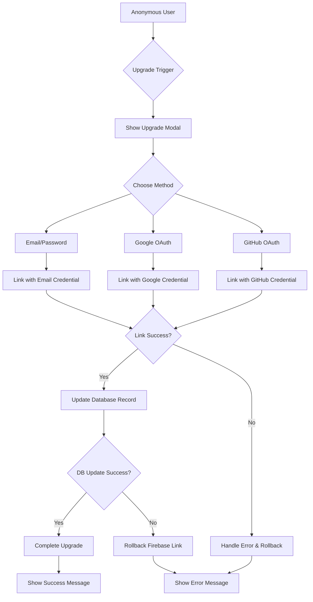

# Design Document

## Overview

The Anonymous Account Linking system enables seamless transition from temporary guest accounts to permanent user accounts using Firebase's `linkWithCredential` functionality. The design ensures data preservation, handles edge cases gracefully, and provides multiple upgrade paths while maintaining the existing authentication architecture.

## Architecture

### High-Level Flow



### System Components

1. **Upgrade Trigger System**: Detects when to prompt users for account upgrade
2. **Account Linking Service**: Handles Firebase credential linking
3. **Data Migration Service**: Ensures data preservation during upgrade
4. **Error Recovery System**: Handles failures and rollbacks
5. **UI Components**: Upgrade modals and prompts

## Components and Interfaces

### 1. Account Upgrade Service

```typescript
interface AccountUpgradeService {
  // Check if user should be prompted for upgrade
  shouldPromptUpgrade(user: User): Promise<boolean>;

  // Link anonymous account with email/password
  linkWithEmailPassword(
    email: string,
    password: string,
  ): Promise<UpgradeResult>;

  // Link anonymous account with OAuth provider
  linkWithOAuthProvider(provider: "google" | "github"): Promise<UpgradeResult>;

  // Rollback failed upgrade attempt
  rollbackUpgrade(backupData: UserBackup): Promise<void>;
}

interface UpgradeResult {
  success: boolean;
  user?: User;
  error?: string;
  requiresEmailVerification?: boolean;
}
```

### 2. Upgrade Prompt System

```typescript
interface UpgradePromptManager {
  // Show upgrade prompt based on trigger
  showUpgradePrompt(trigger: UpgradeTrigger): void;

  // Track prompt dismissals to avoid spam
  markPromptDismissed(trigger: UpgradeTrigger): void;

  // Check if prompt should be shown
  canShowPrompt(trigger: UpgradeTrigger): boolean;
}

type UpgradeTrigger =
  | "milestone_reached"
  | "session_expiring"
  | "premium_feature_access"
  | "manual_request";
```

### 3. Data Backup and Migration

```typescript
interface DataMigrationService {
  // Create backup before upgrade
  createUserBackup(userId: string): Promise<UserBackup>;

  // Update user record after successful linking
  migrateAnonymousToPermament(
    userId: string,
    newProvider: string,
    email?: string,
  ): Promise<void>;

  // Restore from backup if upgrade fails
  restoreFromBackup(backup: UserBackup): Promise<void>;
}

interface UserBackup {
  userId: string;
  userData: User;
  timestamp: string;
  gameData?: any; // Additional game-specific data
}
```

## Data Models

### Updated User Model

```typescript
interface User {
  name: string;
  email: string | null;
  id: string;
  provider: string;
  role: string;
  profileURL?: string;
  avatarId?: string;
  isAnonymous?: boolean;
  createdAt: string;
  lastLoginAt: string;
  xp: number;

  // New fields for account linking
  upgradedAt?: string;
  originalProvider?: string; // Track if user was originally anonymous
  upgradePromptsDismissed?: UpgradeTrigger[];
  lastUpgradePrompt?: string;
}
```

### Upgrade Tracking

```typescript
interface UpgradeAttempt {
  id: string;
  userId: string;
  attemptedAt: string;
  method: "email" | "google" | "github";
  success: boolean;
  errorCode?: string;
  errorMessage?: string;
  completedAt?: string;
}
```

## Error Handling

### Error Categories

1. **Firebase Linking Errors**
   - `auth/credential-already-in-use`: Email already associated with another account
   - `auth/email-already-in-use`: Email exists in different account
   - `auth/invalid-credential`: Invalid OAuth token
   - `auth/provider-already-linked`: Provider already linked to account

2. **Database Update Errors**
   - Network connectivity issues
   - Firestore write failures
   - Concurrent modification conflicts

3. **User Input Errors**
   - Invalid email format
   - Weak password
   - OAuth popup blocked

### Error Recovery Strategies

```typescript
interface ErrorRecoveryStrategy {
  // Handle credential conflicts
  handleCredentialConflict(error: FirebaseError): Promise<RecoveryAction>;

  // Retry failed operations
  retryWithBackoff(
    operation: () => Promise<any>,
    maxRetries: number,
  ): Promise<any>;

  // Graceful degradation
  fallbackToAnonymous(error: any): Promise<void>;
}

type RecoveryAction =
  | "merge_accounts"
  | "choose_different_email"
  | "sign_in_existing"
  | "cancel_upgrade";
```

## Testing Strategy

### Unit Tests

1. **Account Linking Service Tests**
   - Test successful email/password linking
   - Test successful OAuth linking
   - Test error handling for each provider
   - Test rollback functionality

2. **Data Migration Tests**
   - Test data preservation during upgrade
   - Test backup creation and restoration
   - Test atomic database updates

3. **Prompt System Tests**
   - Test trigger conditions
   - Test prompt dismissal tracking
   - Test prompt timing logic

### Integration Tests

1. **End-to-End Upgrade Flow**
   - Complete upgrade process for each method
   - Test data integrity after upgrade
   - Test user experience continuity

2. **Error Scenarios**
   - Network interruption during upgrade
   - Concurrent upgrade attempts
   - Database failures during migration

3. **Cross-Device Testing**
   - Upgrade on one device, verify on another
   - Session handling across devices
   - Data synchronization

### Performance Tests

1. **Upgrade Process Performance**
   - Measure upgrade completion time
   - Test with large user datasets
   - Monitor Firebase quota usage

2. **Prompt System Performance**
   - Test prompt decision logic performance
   - Memory usage of prompt tracking
   - UI responsiveness during prompts

## Security Considerations

### Data Protection

1. **Backup Security**
   - Encrypt sensitive data in backups
   - Automatic backup cleanup after successful upgrade
   - Access control for backup operations

2. **Credential Handling**
   - Secure OAuth token management
   - Password validation and hashing
   - Protection against credential stuffing

3. **Session Security**
   - Secure session transition during upgrade
   - Prevent session hijacking during linking
   - Proper cookie management

### Privacy Compliance

1. **Data Retention**
   - Clear policies for anonymous user data
   - Proper data deletion for failed upgrades
   - User consent for data migration

2. **Audit Trail**
   - Log all upgrade attempts
   - Track data access during migration
   - Compliance with data protection regulations

## Implementation Phases

### Phase 1: Core Linking Infrastructure

- Implement basic Firebase credential linking
- Create data backup and migration services
- Add error handling and rollback mechanisms

### Phase 2: User Interface and Experience

- Design and implement upgrade modals
- Create upgrade prompt system
- Add success/error feedback UI

### Phase 3: Advanced Features and Optimization

- Implement smart prompt triggers
- Add analytics and monitoring
- Optimize performance and user experience

### Phase 4: Testing and Deployment

- Comprehensive testing across all scenarios
- Gradual rollout with feature flags
- Monitor and iterate based on user feedback
