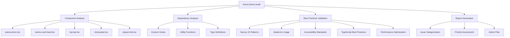

# Design Document

## Overview

This design outlines a comprehensive audit system for the `arena-demo.tsx` component and its dependencies to ensure adherence to Next.js 15 and shadcn/ui best practices. The audit will systematically analyze code quality, performance, accessibility, and modern React patterns across the entire component ecosystem.

## Architecture

### Audit Framework Structure



### Component Dependency Map

Based on the analysis, the audit scope includes:

**Primary Component:**

- `components/arena-demo.tsx` - Main game arena interface

**Direct Dependencies:**

- `components/meme-card-hand.tsx` - Card display and selection
- `components/top-bar.tsx` - Game status and timer
- `components/chat-panel.tsx` - Real-time chat interface
- `components/players-list.tsx` - Player status display
- `components/meme-card.tsx` - Individual card component

**Hooks:**

- `hooks/useMemeCardSelection.ts` - Card selection logic
- `hooks/use-mobile.ts` - Mobile detection

**Utilities:**

- `lib/utils/meme-card-pool.ts` - Card management system
- `lib/utils.ts` - General utilities

**UI Components:**

- Various shadcn/ui components (Button, Card, Badge, etc.)

## Components and Interfaces

### Audit Engine Interface

```typescript
interface AuditResult {
  component: string;
  category: AuditCategory;
  severity: "critical" | "high" | "medium" | "low";
  issue: string;
  description: string;
  recommendation: string;
  codeExample?: string;
  lineNumber?: number;
}

interface ComponentAudit {
  componentPath: string;
  results: AuditResult[];
  score: number; // 0-100
  summary: string;
}

interface AuditReport {
  components: ComponentAudit[];
  overallScore: number;
  criticalIssues: number;
  totalIssues: number;
  recommendations: string[];
}
```

### Audit Categories

1. **Next.js 15 Compliance**
   - Client/Server component boundaries
   - App Router patterns
   - Performance optimizations
   - Modern React patterns

2. **shadcn/ui Best Practices**
   - Component usage patterns
   - Styling conventions
   - Theme integration
   - Accessibility compliance

3. **TypeScript Quality**
   - Type safety
   - Interface definitions
   - Generic usage
   - Import/export patterns

4. **Performance Optimization**
   - Memoization opportunities
   - Re-render prevention
   - Bundle size considerations
   - Loading strategies

5. **Accessibility Standards**
   - ARIA labels and roles
   - Keyboard navigation
   - Focus management
   - Screen reader compatibility

## Data Models

### Audit Configuration

```typescript
interface AuditConfig {
  nextjsVersion: "15.4.5";
  shadcnVersion: "latest";
  strictMode: boolean;
  accessibilityLevel: "AA" | "AAA";
  performanceThresholds: {
    componentSize: number;
    renderTime: number;
    memoryUsage: number;
  };
}
```

### Issue Classification

```typescript
enum IssueType {
  DEPRECATED_PATTERN = "deprecated_pattern",
  PERFORMANCE_ISSUE = "performance_issue",
  ACCESSIBILITY_VIOLATION = "accessibility_violation",
  TYPE_SAFETY_ISSUE = "type_safety_issue",
  STYLING_INCONSISTENCY = "styling_inconsistency",
  BEST_PRACTICE_VIOLATION = "best_practice_violation",
}

enum Severity {
  CRITICAL = "critical", // Breaks functionality or major violations
  HIGH = "high", // Significant issues affecting UX/performance
  MEDIUM = "medium", // Moderate improvements needed
  LOW = "low", // Minor optimizations or style improvements
}
```

## Error Handling

### Audit Error Management

```typescript
interface AuditError {
  component: string;
  error: string;
  stack?: string;
  recoverable: boolean;
}

class AuditErrorHandler {
  private errors: AuditError[] = [];

  handleError(component: string, error: Error, recoverable = true): void {
    this.errors.push({
      component,
      error: error.message,
      stack: error.stack,
      recoverable,
    });
  }

  getErrors(): AuditError[] {
    return this.errors;
  }

  hasCriticalErrors(): boolean {
    return this.errors.some((e) => !e.recoverable);
  }
}
```

## Testing Strategy

### Audit Validation Tests

1. **Component Analysis Tests**
   - Verify all components are discovered
   - Validate dependency mapping
   - Test audit rule execution

2. **Best Practice Detection Tests**
   - Mock components with known issues
   - Verify correct issue identification
   - Test severity classification

3. **Report Generation Tests**
   - Validate report structure
   - Test prioritization logic
   - Verify recommendation accuracy

### Test Data Preparation

```typescript
interface MockComponent {
  path: string;
  content: string;
  expectedIssues: AuditResult[];
}

const mockComponents: MockComponent[] = [
  {
    path: "test-component.tsx",
    content: `
      // Component with known issues for testing
      export function TestComponent() {
        const [state, setState] = useState(); // Missing type
        return <div onClick={() => {}}></div>; // Missing accessibility
      }
    `,
    expectedIssues: [
      {
        category: "typescript",
        severity: "medium",
        issue: "missing_type_annotation",
        // ... other properties
      },
    ],
  },
];
```

## Specific Audit Focus Areas

### Arena Demo Component Issues Identified

Based on initial analysis, key areas to audit:

1. **State Management Complexity**
   - Multiple useState hooks could be consolidated
   - Consider useReducer for complex state

2. **Performance Optimizations**
   - Missing memoization for expensive operations
   - Potential unnecessary re-renders

3. **Accessibility Gaps**
   - Some interactive elements lack proper ARIA labels
   - Focus management could be improved

4. **TypeScript Improvements**
   - Some type assertions could be more specific
   - Interface definitions could be more comprehensive

### Component-Specific Audit Rules

#### MemeCardHand Component

- **Performance**: Check for unnecessary re-renders during card selection
- **Accessibility**: Verify keyboard navigation and screen reader support
- **Responsive Design**: Validate mobile/desktop layout switching

#### TopBar Component

- **Memoization**: Verify proper use of memo and useMemo
- **Timer Performance**: Check for potential memory leaks in timer logic
- **Accessibility**: Validate timer announcements for screen readers

#### ChatPanel Component

- **Performance**: Check ScrollArea performance with large message lists
- **Accessibility**: Verify proper focus management and message announcements
- **Real-time Updates**: Validate efficient message rendering

#### PlayersList Component

- **Performance**: Check for efficient player status updates
- **Accessibility**: Verify proper player status announcements
- **Responsive Design**: Validate mobile panel behavior

### shadcn/ui Usage Audit

1. **Component Composition**
   - Verify proper use of compound components (Card + CardHeader + CardContent)
   - Check for consistent styling patterns

2. **Theme Integration**
   - Validate CSS variable usage
   - Check for proper dark/light theme support

3. **Accessibility Compliance**
   - Verify shadcn/ui components maintain accessibility features
   - Check for proper ARIA attribute preservation

### Next.js 15 Specific Checks

1. **Client Component Usage**
   - Verify "use client" directive placement
   - Check for unnecessary client components

2. **App Router Patterns**
   - Validate proper component organization
   - Check for optimal loading strategies

3. **Performance Features**
   - Verify use of React 18+ features (Suspense, Concurrent Features)
   - Check for proper code splitting opportunities

## Implementation Approach

### Audit Execution Flow

1. **Discovery Phase**
   - Scan component files and dependencies
   - Build dependency graph
   - Identify audit scope

2. **Analysis Phase**
   - Parse component code using AST
   - Apply audit rules systematically
   - Collect issues and metrics

3. **Validation Phase**
   - Cross-reference with best practices
   - Validate against framework guidelines
   - Assess severity and impact

4. **Reporting Phase**
   - Generate comprehensive report
   - Prioritize issues by impact
   - Provide actionable recommendations

### Audit Tools and Techniques

1. **Static Analysis**
   - TypeScript compiler API for type checking
   - ESLint rules for code quality
   - Custom AST parsing for pattern detection

2. **Runtime Analysis**
   - Performance profiling hooks
   - Accessibility testing tools
   - Component render analysis

3. **Best Practice Validation**
   - Framework-specific rule sets
   - Design system compliance checks
   - Performance benchmark comparisons

This design provides a comprehensive framework for auditing the arena-demo component ecosystem, ensuring all aspects of modern React development best practices are thoroughly evaluated and improved.
