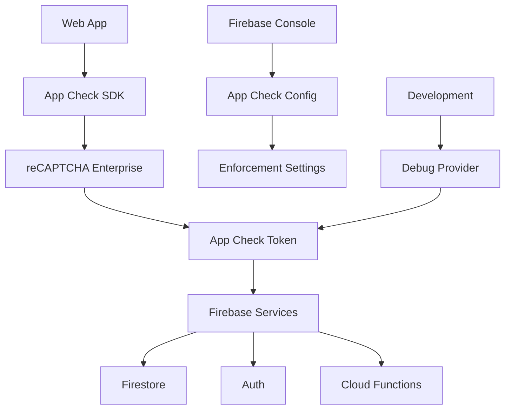

# Design Document

## Overview

This design implements Firebase App Check with reCAPTCHA Enterprise to secure the Meme Battles application against abuse and unauthorized access. The solution will integrate seamlessly with the existing Firebase setup, providing invisible security that doesn't impact user experience while protecting Firestore, Authentication, and other Firebase services.

## Architecture

### High-Level Architecture



### Component Integration

The App Check implementation will integrate with the existing Firebase client configuration in `firebase/client.ts`, adding App Check initialization alongside the current Firebase services (Auth, Firestore, Storage).

### Environment Handling

- **Production**: Uses reCAPTCHA Enterprise provider with real site key
- **Development**: Uses App Check debug provider for local development
- **Testing**: Configurable debug tokens for CI/CD environments

## Components and Interfaces

### 1. App Check Configuration Service

**Location**: `lib/services/app-check-service.ts`

```typescript
interface AppCheckConfig {
  provider: "recaptcha" | "debug";
  siteKey?: string;
  debugToken?: string;
  isTokenAutoRefreshEnabled: boolean;
}

interface AppCheckService {
  initializeAppCheck(app: FirebaseApp): Promise<AppCheck>;
  getAppCheckToken(): Promise<string>;
  isDebugMode(): boolean;
}
```

**Responsibilities**:

- Initialize App Check with appropriate provider based on environment
- Handle token refresh and validation
- Provide debug mode detection and configuration

### 2. Environment Detection Utility

**Location**: `lib/utils/environment.ts`

```typescript
interface EnvironmentConfig {
  isDevelopment: boolean;
  isProduction: boolean;
  isTest: boolean;
  appCheckDebugToken?: string;
}
```

**Responsibilities**:

- Detect current environment (development, production, test)
- Provide environment-specific configuration
- Handle debug token management

### 3. App Check Provider Component

**Location**: `providers/app-check-provider.tsx`

```typescript
interface AppCheckContextValue {
  isInitialized: boolean;
  isDebugMode: boolean;
  tokenRefreshEnabled: boolean;
  error?: Error;
}
```

**Responsibilities**:

- Provide App Check context to the application
- Handle initialization state and errors
- Expose debug mode status for development tools

### 4. Enhanced Firebase Client

**Location**: `firebase/client.ts` (modified)

The existing Firebase client will be enhanced to include App Check initialization:

```typescript
// New exports
export const appCheck: AppCheck;
export const isAppCheckEnabled: boolean;
```

**Responsibilities**:

- Initialize App Check alongside existing Firebase services
- Export App Check instance for use throughout the application
- Handle App Check initialization errors gracefully

## Data Models

### Environment Variables

New environment variables will be added to support App Check:

```typescript
interface AppCheckEnvironment {
  // Production reCAPTCHA Enterprise site key
  NEXT_PUBLIC_RECAPTCHA_SITE_KEY: string;

  // Debug token for development/testing
  NEXT_PUBLIC_APP_CHECK_DEBUG_TOKEN?: string;

  // Environment flag
  NODE_ENV: "development" | "production" | "test";
}
```

### App Check Token Structure

```typescript
interface AppCheckToken {
  token: string;
  expireTimeMillis: number;
  issuedAtTimeMillis: number;
}
```

### Configuration Object

```typescript
interface AppCheckConfiguration {
  provider: ReCaptchaEnterpriseProvider | DebugProvider;
  isTokenAutoRefreshEnabled: boolean;
  tokenTTL?: number; // Custom TTL in milliseconds
}
```

## Error Handling

### App Check Initialization Errors

```typescript
enum AppCheckErrorType {
  INITIALIZATION_FAILED = "app-check/initialization-failed",
  INVALID_SITE_KEY = "app-check/invalid-site-key",
  NETWORK_ERROR = "app-check/network-error",
  TOKEN_REFRESH_FAILED = "app-check/token-refresh-failed",
}

interface AppCheckError extends Error {
  code: AppCheckErrorType;
  details?: Record<string, unknown>;
}
```

**Error Handling Strategy**:

1. **Graceful Degradation**: App continues to function even if App Check fails to initialize
2. **Retry Logic**: Automatic retry for network-related failures
3. **Logging**: Comprehensive error logging for debugging
4. **User Notification**: Silent handling in production, detailed errors in development

### Token Validation Errors

When App Check enforcement is enabled, the application will handle token validation errors:

```typescript
interface TokenValidationError {
  code: "app-check/token-invalid" | "app-check/token-expired";
  message: string;
  retryable: boolean;
}
```

**Handling Strategy**:

- Automatic token refresh for expired tokens
- User-friendly error messages for persistent failures
- Fallback mechanisms for critical operations

## Testing Strategy

### Unit Testing

**Test Coverage Areas**:

1. App Check service initialization with different providers
2. Environment detection logic
3. Token refresh mechanisms
4. Error handling scenarios

**Test Files**:

- `__tests__/lib/services/app-check-service.test.ts`
- `__tests__/lib/utils/environment.test.ts`
- `__tests__/providers/app-check-provider.test.tsx`

### Integration Testing

**Test Scenarios**:

1. App Check integration with Firebase services
2. Token validation in protected operations
3. Debug mode functionality in development
4. Environment switching behavior

### End-to-End Testing

**Test Cases**:

1. Complete user flow with App Check enabled
2. Authentication with App Check tokens
3. Firestore operations with token validation
4. Error scenarios and recovery

### Testing Configuration

```typescript
// jest.setup.ts additions
interface MockAppCheck {
  getToken: jest.MockedFunction<() => Promise<AppCheckToken>>;
  initialize: jest.MockedFunction<() => Promise<void>>;
}

// Mock App Check for testing
jest.mock("firebase/app-check", () => ({
  initializeAppCheck: jest.fn(),
  getAppCheckToken: jest.fn(),
  ReCaptchaEnterpriseProvider: jest.fn(),
}));
```

## Implementation Phases

### Phase 1: Core App Check Setup

- Install and configure reCAPTCHA Enterprise
- Implement basic App Check initialization
- Add environment detection utilities

### Phase 2: Integration with Firebase Services

- Modify Firebase client configuration
- Add App Check provider component
- Implement error handling

### Phase 3: Development and Testing Support

- Add debug provider for development
- Implement comprehensive testing
- Add monitoring and logging

### Phase 4: Production Deployment and Monitoring

- Deploy with enforcement disabled
- Monitor metrics and validate functionality
- Gradually enable enforcement

## Security Considerations

### Token Security

- App Check tokens are automatically managed by the Firebase SDK
- Tokens have appropriate TTL (1 hour default) to balance security and performance
- Automatic token refresh prevents service interruption

### reCAPTCHA Enterprise Configuration

- Score-based site keys provide invisible security
- No user challenges required
- Appropriate domain restrictions configured

### Debug Mode Security

- Debug tokens only available in development/test environments
- Debug mode clearly identified and logged
- Production builds exclude debug functionality

## Performance Considerations

### Token Refresh Strategy

- Tokens refresh at approximately half the TTL duration (30 minutes for 1-hour TTL)
- Automatic refresh prevents service interruption
- Background refresh doesn't impact user experience

### Network Impact

- App Check adds minimal overhead to Firebase requests
- Token validation happens server-side
- Caching reduces repeated validation calls

### Cost Optimization

- Default 1-hour TTL balances security and cost
- Monitoring helps optimize refresh frequency
- reCAPTCHA Enterprise pricing considered in TTL configuration
