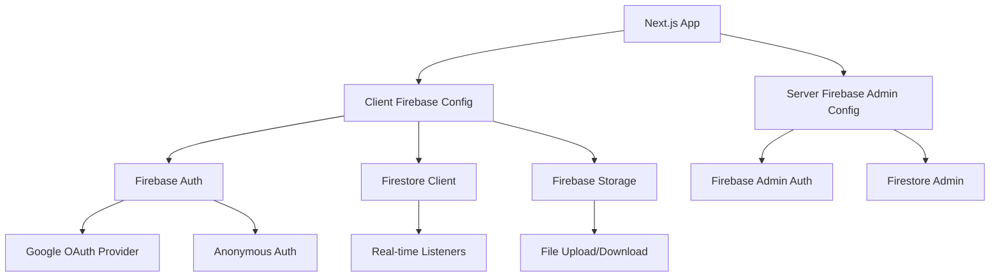

# Firebase Configuration Design Document

## Overview

This design establishes a robust Firebase configuration for the Meme Battles application, providing authentication, real-time database, and storage capabilities. The architecture follows Firebase best practices with proper environment variable management, error handling, and security considerations.

## Architecture

The Firebase configuration follows a dual-initialization pattern:

- **Client-side**: Handles user-facing authentication flows and real-time data subscriptions
- **Server-side**: Manages admin operations, user verification, and secure data operations



## Components and Interfaces

### Client Configuration (`firebase/client.ts`)

**Purpose**: Initialize Firebase services for client-side operations

**Key Components**:

- Firebase App initialization with environment-based config
- Authentication service with Google and Anonymous providers
- Firestore client for real-time data operations
- Storage client for file operations

**Interface**:

```typescript
export interface FirebaseClientServices {
  auth: Auth;
  db: Firestore;
  storage: FirebaseStorage;
}
```

### Admin Configuration (`firebase/admin.ts`)

**Purpose**: Initialize Firebase Admin SDK for server-side operations

**Key Components**:

- Admin app initialization with service account credentials
- Admin Auth for user verification and management
- Admin Firestore for secure server-side operations

**Interface**:

```typescript
export interface FirebaseAdminServices {
  auth: AdminAuth;
  db: AdminFirestore;
}
```

### Authentication Providers

**Google OAuth Provider**:

- Configured with appropriate scopes (profile, email)
- Handles redirect flow for web authentication
- Manages token refresh and session persistence

**Anonymous Authentication**:

- Creates temporary user sessions
- Generates random display names
- Provides upgrade path to permanent accounts

### Environment Configuration

**Required Client Variables**:

- `NEXT_PUBLIC_FIREBASE_API_KEY`
- `NEXT_PUBLIC_FIREBASE_AUTH_DOMAIN`
- `NEXT_PUBLIC_FIREBASE_PROJECT_ID`
- `NEXT_PUBLIC_FIREBASE_STORAGE_BUCKET`
- `NEXT_PUBLIC_FIREBASE_MESSAGING_SENDER_ID`
- `NEXT_PUBLIC_FIREBASE_APP_ID`
- `NEXT_PUBLIC_FIREBASE_MEASUREMENT_ID`

**Required Admin Variables**:

- `FIREBASE_PROJECT_ID`
- `FIREBASE_CLIENT_EMAIL`
- `FIREBASE_PRIVATE_KEY`

## Data Models

### User Profile Model

```typescript
interface UserProfile {
  uid: string;
  displayName: string;
  email?: string;
  photoURL?: string;
  isAnonymous: boolean;
  createdAt: Timestamp;
  lastLoginAt: Timestamp;
}
```

### Authentication State Model

```typescript
interface AuthState {
  user: User | null;
  loading: boolean;
  error: string | null;
}
```

## Error Handling

### Configuration Errors

- Missing environment variables: Clear error messages with variable names
- Invalid credentials: Specific feedback about credential issues
- Network connectivity: Retry logic with exponential backoff

### Authentication Errors

- OAuth failures: User-friendly messages with retry options
- Anonymous auth issues: Fallback to offline mode where possible
- Token expiration: Automatic refresh with user notification

### Database Errors

- Connection failures: Offline mode with local caching
- Permission denied: Clear messaging about access restrictions
- Quota exceeded: Graceful degradation with user notification

### Storage Errors

- Upload failures: Retry mechanism with progress indication
- File size/type validation: Pre-upload validation with clear feedback
- Quota limits: User notification with usage statistics

## Testing Strategy

### Unit Tests

- Firebase initialization functions
- Environment variable validation
- Error handling scenarios
- Authentication state management

### Integration Tests

- End-to-end authentication flows (Google OAuth, Anonymous)
- Firestore read/write operations
- Storage upload/download operations
- Real-time listener functionality

### Security Tests

- Firestore security rules validation
- Authentication token verification
- File access permissions
- Cross-user data isolation

### Performance Tests

- Initial load time with Firebase initialization
- Real-time listener performance under load
- File upload/download speed benchmarks
- Offline/online transition handling

## Security Considerations

### Firestore Security Rules

```javascript
rules_version = '2';
service cloud.firestore {
  match /databases/{database}/documents {
    // Users can only access their own profile
    match /users/{userId} {
      allow read, write: if request.auth != null && request.auth.uid == userId;
    }

    // Game rooms have specific access patterns
    match /rooms/{roomId} {
      allow read: if request.auth != null;
      allow write: if request.auth != null &&
        (resource == null || request.auth.uid in resource.data.players);
    }
  }
}
```

### Storage Security Rules

```javascript
rules_version = '2';
service firebase.storage {
  match /b/{bucket}/o {
    match /users/{userId}/{allPaths=**} {
      allow read, write: if request.auth != null && request.auth.uid == userId;
    }

    match /public/{allPaths=**} {
      allow read: if true;
      allow write: if request.auth != null;
    }
  }
}
```

### Environment Security

- Private keys stored securely with proper newline handling
- Client-side config uses public environment variables only
- Admin credentials never exposed to client-side code
