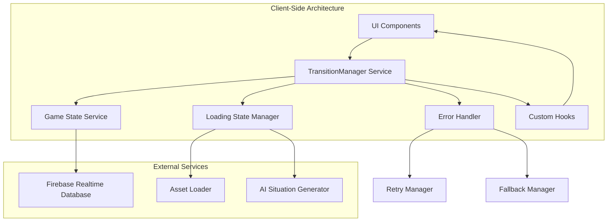
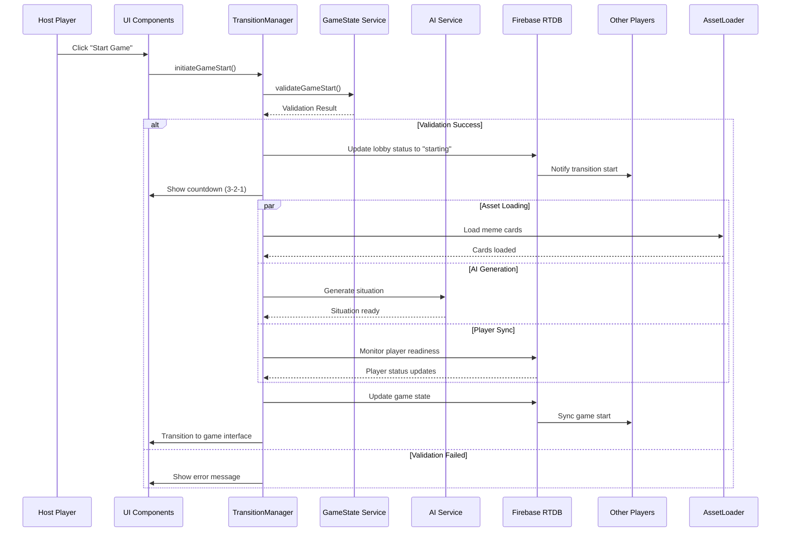

# Design Document

## Overview

The game transitions system ensures seamless, engaging user experiences when moving between different states of Meme Battles gameplay. This system orchestrates the critical transition from lobby creation/joining to active gameplay, managing loading states, error recovery, and maintaining real-time synchronization across all players. The design prioritizes user engagement, clear communication, and robust error handling to create smooth transitions that enhance rather than interrupt the gaming experience.

The system is built on Firebase Realtime Database for real-time synchronization, with client-side state management using React hooks and SWR for caching. It implements progressive loading strategies, optimistic updates, and graceful degradation to handle various network conditions and device capabilities.

## Architecture

### High-Level Architecture



### Transition Flow Architecture



### State Management Architecture

The transition system uses a hierarchical state machine to manage different phases:

```typescript
interface TransitionState {
  phase: TransitionPhase;
  progress: number;
  currentStep: string;
  playerStates: Record<string, PlayerTransitionState>;
  errors: TransitionError[];
  canCancel: boolean;
  estimatedTimeRemaining?: number;
}

type TransitionPhase =
  | "idle"
  | "validating"
  | "countdown"
  | "loading"
  | "syncing"
  | "complete"
  | "error"
  | "cancelled";

interface PlayerTransitionState {
  playerId: string;
  status: "ready" | "loading" | "error" | "disconnected";
  progress: number;
  lastSeen: string;
  connectionQuality: "good" | "fair" | "poor";
}
```

## Components and Interfaces

### Core Service Layer

#### TransitionManager

The central orchestrator for all game transitions:

```typescript
interface TransitionManager {
  // Core transition methods
  initiateGameStart(
    lobbyCode: string,
    hostUid: string
  ): Promise<TransitionResult>;
  cancelTransition(lobbyCode: string, reason: string): Promise<void>;
  retryTransition(lobbyCode: string): Promise<TransitionResult>;

  // State management
  getTransitionState(lobbyCode: string): TransitionState;
  subscribeToTransition(
    lobbyCode: string,
    callback: (state: TransitionState) => void
  ): UnsubscribeFunction;

  // Player management
  updatePlayerStatus(
    lobbyCode: string,
    playerId: string,
    status: PlayerTransitionState
  ): Promise<void>;
  handlePlayerDisconnection(lobbyCode: string, playerId: string): Promise<void>;
  handlePlayerReconnection(lobbyCode: string, playerId: string): Promise<void>;

  // Progress tracking
  updateProgress(lobbyCode: string, step: string, progress: number): void;
  setEstimatedTime(lobbyCode: string, timeMs: number): void;
}

interface TransitionResult {
  success: boolean;
  transitionId: string;
  error?: TransitionError;
  fallbackApplied?: boolean;
}

interface TransitionError {
  type: TransitionErrorType;
  message: string;
  recoverable: boolean;
  retryAfter?: number;
  fallbackAvailable: boolean;
}

type TransitionErrorType =
  | "validation_failed"
  | "asset_loading_failed"
  | "ai_generation_failed"
  | "player_sync_failed"
  | "network_error"
  | "timeout"
  | "insufficient_players";
```

#### LoadingStateManager

Manages the loading of assets and game preparation:

```typescript
interface LoadingStateManager {
  // Asset loading
  loadMemeCards(playerCount: number): Promise<MemeCard[][]>;
  preloadGameAssets(): Promise<void>;

  // AI integration
  generateSituation(categories: string[], fallback?: boolean): Promise<string>;

  // Progress tracking
  trackLoadingProgress(step: LoadingStep, progress: number): void;
  getLoadingProgress(): LoadingProgress;

  // Optimization
  optimizeForConnection(connectionQuality: ConnectionQuality): void;
  enableOfflineMode(): void;
}

interface LoadingProgress {
  overall: number;
  steps: Record<LoadingStep, number>;
  currentStep: LoadingStep;
  estimatedTimeRemaining: number;
}

type LoadingStep =
  | "validating"
  | "dealing_cards"
  | "generating_situation"
  | "syncing_players"
  | "initializing_game";
```

#### ErrorHandler

Comprehensive error handling and recovery:

```typescript
interface ErrorHandler {
  // Error handling
  handleTransitionError(
    error: TransitionError,
    context: TransitionContext
  ): Promise<ErrorResolution>;

  // Retry logic
  shouldRetry(error: TransitionError, attemptCount: number): boolean;
  getRetryDelay(attemptCount: number): number;

  // Fallback management
  getFallbackOptions(error: TransitionError): FallbackOption[];
  applyFallback(
    option: FallbackOption,
    context: TransitionContext
  ): Promise<void>;

  // User communication
  getErrorMessage(error: TransitionError, userFriendly: boolean): string;
  getRecoveryActions(error: TransitionError): RecoveryAction[];
}

interface ErrorResolution {
  action: "retry" | "fallback" | "cancel" | "wait";
  delay?: number;
  fallbackOption?: FallbackOption;
  userMessage: string;
}

interface FallbackOption {
  type:
    | "backup_situation"
    | "reduced_quality"
    | "offline_mode"
    | "simplified_game";
  description: string;
  impact: string;
}
```

### Custom Hooks Layer

#### useGameTransition

Main hook for managing game transitions:

```typescript
interface UseGameTransitionReturn {
  // State
  transitionState: TransitionState;
  isTransitioning: boolean;
  canCancel: boolean;
  error: TransitionError | null;

  // Actions
  startTransition: () => Promise<void>;
  cancelTransition: (reason?: string) => Promise<void>;
  retryTransition: () => Promise<void>;

  // Progress
  progress: number;
  currentStep: string;
  estimatedTimeRemaining?: number;

  // Player management
  playerStates: Record<string, PlayerTransitionState>;
  disconnectedPlayers: string[];
}

function useGameTransition(lobbyCode: string): UseGameTransitionReturn;
```

#### useTransitionProgress

Hook for detailed progress tracking:

```typescript
interface UseTransitionProgressReturn {
  // Progress tracking
  overallProgress: number;
  stepProgress: Record<LoadingStep, number>;
  currentStep: LoadingStep;

  // Time estimates
  estimatedTimeRemaining: number;
  elapsedTime: number;

  // Step details
  stepDescriptions: Record<LoadingStep, string>;
  completedSteps: LoadingStep[];
  failedSteps: LoadingStep[];
}

function useTransitionProgress(lobbyCode: string): UseTransitionProgressReturn;
```

#### useConnectionQuality

Hook for monitoring and adapting to connection quality:

```typescript
interface UseConnectionQualityReturn {
  // Connection monitoring
  connectionQuality: ConnectionQuality;
  latency: number;
  bandwidth: number;
  isStable: boolean;

  // Adaptive features
  recommendedQuality: QualityLevel;
  shouldUseOfflineMode: boolean;
  optimizationSuggestions: string[];
}

function useConnectionQuality(): UseConnectionQualityReturn;
```

### UI Components Architecture

#### Enhanced Component Structure

```
components/
├── transitions/
│   ├── GameTransitionContainer.tsx     # Main transition orchestrator
│   ├── TransitionCountdown.tsx         # 3-2-1 countdown display
│   ├── LoadingProgress.tsx             # Progress indicators and steps
│   ├── PlayerSyncStatus.tsx            # Player readiness display
│   ├── TransitionError.tsx             # Error handling and recovery
│   └── ConnectionStatus.tsx            # Network status monitoring
├── loading/
│   ├── ProgressBar.tsx                 # Determinate progress bar
│   ├── StepIndicator.tsx               # Step-by-step progress
│   ├── LoadingSpinner.tsx              # Indeterminate loading
│   └── SkeletonLoader.tsx              # Content placeholders
└── shared/
    ├── AnimatedTransition.tsx          # Smooth UI transitions
    ├── ErrorBoundary.tsx               # Error containment
    └── AdaptiveContent.tsx             # Connection-aware content
```

## Data Models

### Firebase Realtime Database Schema

Enhanced lobby structure for transitions:

```json
{
  "lobbies": {
    "{lobbyCode}": {
      "transition": {
        "state": "loading",
        "phase": "dealing_cards",
        "progress": 45,
        "startedAt": "2025-01-08T10:10:00.000Z",
        "estimatedCompletion": "2025-01-08T10:10:30.000Z",
        "canCancel": true,
        "steps": {
          "validating": { "status": "completed", "progress": 100 },
          "dealing_cards": { "status": "in_progress", "progress": 45 },
          "generating_situation": { "status": "pending", "progress": 0 },
          "syncing_players": { "status": "pending", "progress": 0 },
          "initializing_game": { "status": "pending", "progress": 0 }
        },
        "playerStates": {
          "{playerId}": {
            "status": "loading",
            "progress": 60,
            "lastSeen": "2025-01-08T10:10:25.000Z",
            "connectionQuality": "good",
            "errors": []
          }
        },
        "errors": [],
        "fallbacksApplied": [],
        "retryCount": 0
      },
      "gameState": {
        "situation": "When your friend says they'll be ready in 5 minutes...",
        "situationSource": "ai", // "ai" | "fallback"
        "playerCards": {
          "{playerId}": [
            "meme_001",
            "meme_002",
            "meme_003",
            "meme_004",
            "meme_005",
            "meme_006",
            "meme_007"
          ]
        },
        "round": 1,
        "phase": "submission",
        "phaseStartTime": "2025-01-08T10:11:00.000Z",
        "timeLimit": 60
      }
    }
  }
}
```

### Type Definitions

```typescript
// Transition configuration
interface TransitionConfig {
  timeouts: {
    validation: number;
    assetLoading: number;
    aiGeneration: number;
    playerSync: number;
    overall: number;
  };
  retryLimits: {
    maxRetries: number;
    backoffMultiplier: number;
    maxBackoffDelay: number;
  };
  fallbacks: {
    enableBackupSituations: boolean;
    allowReducedQuality: boolean;
    enableOfflineMode: boolean;
  };
  playerSync: {
    maxWaitTime: number;
    minPlayersToStart: number;
    disconnectionGracePeriod: number;
  };
}

// Animation and visual feedback
interface TransitionAnimations {
  countdownDuration: number;
  progressBarEasing: string;
  stepTransitionDuration: number;
  errorShakeDuration: number;
  successCelebrationDuration: number;
}

// Accessibility and user preferences
interface TransitionAccessibility {
  respectReducedMotion: boolean;
  provideSoundCues: boolean;
  useHighContrast: boolean;
  enableScreenReaderAnnouncements: boolean;
}
```

## Error Handling

### Error Categories and Recovery Strategies

1. **Validation Errors**
   - Insufficient players: Wait for more players or suggest inviting friends
   - Invalid game settings: Reset to defaults or allow host to modify
   - Lobby state conflicts: Refresh lobby state and retry

2. **Asset Loading Errors**
   - Meme card loading failure: Use cached cards or reduced set
   - Network timeout: Retry with exponential backoff
   - Storage access issues: Fall back to essential assets only

3. **AI Generation Errors**
   - Service unavailable: Use pre-written backup situations
   - Generation timeout: Fall back to simple prompts
   - Content filtering issues: Use safe fallback prompts

4. **Player Synchronization Errors**
   - Player disconnection: Wait with grace period, then continue
   - Sync timeout: Start with ready players, allow late joiners
   - State conflicts: Use server state as authoritative source

5. **Network Errors**
   - Connection loss: Show offline mode options
   - High latency: Adjust timeouts and use optimistic updates
   - Bandwidth limitations: Reduce asset quality and update frequency

### Recovery Implementation

```typescript
class TransitionErrorHandler {
  private retryStrategies: Map<TransitionErrorType, RetryStrategy> = new Map([
    [
      "asset_loading_failed",
      {
        maxRetries: 3,
        backoffStrategy: "exponential",
        fallbackAvailable: true,
      },
    ],
    [
      "ai_generation_failed",
      {
        maxRetries: 2,
        backoffStrategy: "linear",
        fallbackAvailable: true,
      },
    ],
    [
      "player_sync_failed",
      {
        maxRetries: 1,
        backoffStrategy: "none",
        fallbackAvailable: true,
      },
    ],
  ]);

  async handleError(
    error: TransitionError,
    context: TransitionContext
  ): Promise<ErrorResolution> {
    const strategy = this.retryStrategies.get(error.type);

    if (strategy && context.retryCount < strategy.maxRetries) {
      return {
        action: "retry",
        delay: this.calculateBackoffDelay(strategy, context.retryCount),
        userMessage: `Retrying... (${context.retryCount + 1}/${strategy.maxRetries})`,
      };
    }

    if (strategy?.fallbackAvailable) {
      const fallback = await this.selectBestFallback(error, context);
      return {
        action: "fallback",
        fallbackOption: fallback,
        userMessage: `Using backup option: ${fallback.description}`,
      };
    }

    return {
      action: "cancel",
      userMessage: "Unable to start game. Please try again later.",
    };
  }
}
```

## Performance Optimizations

### Progressive Loading Strategy

1. **Essential First**: Load critical game assets before optional enhancements
2. **Lazy Loading**: Load additional content as needed during gameplay
3. **Predictive Loading**: Pre-load likely next assets based on game state
4. **Adaptive Quality**: Adjust asset quality based on connection speed

### Connection-Aware Optimizations

```typescript
interface ConnectionOptimizations {
  // High-speed connections
  highSpeed: {
    enableHighQualityAssets: true;
    preloadNextRound: true;
    useRealTimeSync: true;
    enableRichAnimations: true;
  };

  // Medium-speed connections
  mediumSpeed: {
    enableStandardAssets: true;
    preloadEssentialOnly: true;
    useBatchedSync: true;
    enableBasicAnimations: true;
  };

  // Low-speed connections
  lowSpeed: {
    enableLowQualityAssets: true;
    disablePreloading: true;
    usePollingSync: true;
    disableAnimations: true;
  };
}
```

### Memory Management

1. **Asset Cleanup**: Remove unused assets after transitions
2. **Listener Management**: Properly cleanup Firebase listeners
3. **State Pruning**: Remove old transition states after completion
4. **Cache Management**: Implement LRU cache for frequently used assets

## Testing Strategy

### Unit Testing

1. **TransitionManager**: Test all transition flows and error scenarios
2. **LoadingStateManager**: Test asset loading and progress tracking
3. **ErrorHandler**: Test error classification and recovery strategies
4. **Custom Hooks**: Test state management and side effects

### Integration Testing

1. **End-to-End Transitions**: Test complete lobby-to-game flows
2. **Multi-Player Scenarios**: Test with various player counts and connection speeds
3. **Error Recovery**: Test graceful handling of various failure modes
4. **Network Conditions**: Test under different latency and bandwidth conditions

### Performance Testing

1. **Load Testing**: Test with maximum player counts
2. **Stress Testing**: Test under poor network conditions
3. **Memory Testing**: Monitor for memory leaks during repeated transitions
4. **Battery Testing**: Ensure mobile optimization doesn't drain battery

### Accessibility Testing

1. **Screen Reader**: Test with assistive technologies
2. **Keyboard Navigation**: Ensure all interactions are keyboard accessible
3. **Color Contrast**: Verify sufficient contrast for all UI elements
4. **Motion Sensitivity**: Test reduced motion preferences

## Implementation Phases

### Phase 1: Core Transition System

- Basic TransitionManager implementation
- Simple loading states and progress tracking
- Essential error handling
- Firebase integration for state sync

### Phase 2: Enhanced User Experience

- Animated transitions and visual feedback
- Detailed progress indicators
- Player status monitoring
- Connection quality adaptation

### Phase 3: Advanced Features

- AI integration with fallbacks
- Sophisticated error recovery
- Performance optimizations
- Comprehensive accessibility support

### Phase 4: Polish and Optimization

- Advanced animations and micro-interactions
- Predictive loading and caching
- Analytics and monitoring
- A/B testing for transition flows

This design provides a robust, scalable foundation for smooth game transitions that enhance the Meme Battles experience while handling the complexities of real-time multiplayer coordination, network variability, and diverse device capabilities.
