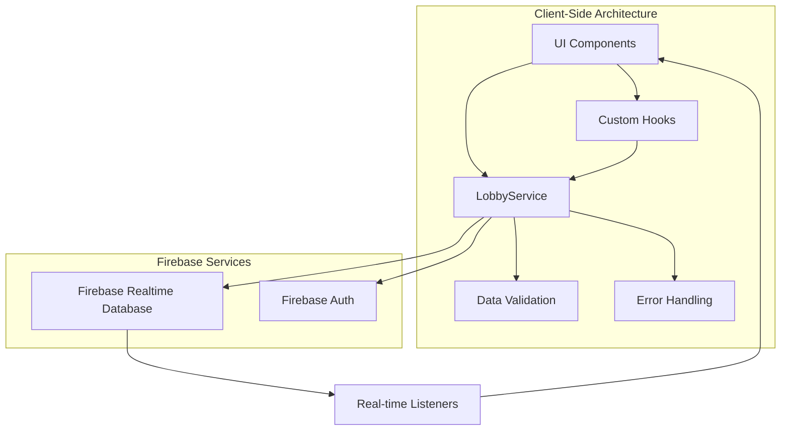
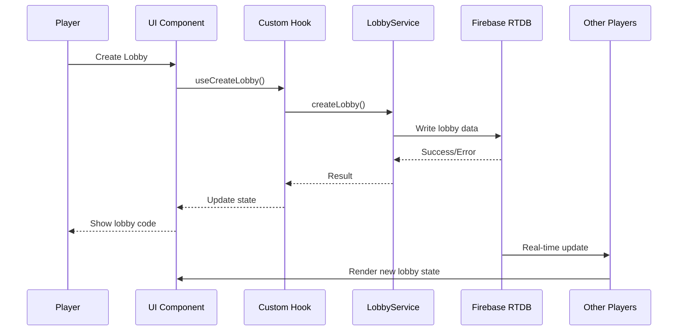

# Design Document

## Overview

The lobby management system serves as the multiplayer coordination layer for Meme Battles, enabling players to create private game rooms, invite friends, configure game settings, and transition seamlessly into active gameplay. The system is built on Firebase Realtime Database to provide real-time synchronization with sub-200ms latency across all connected players.

The architecture follows a client-side service pattern with real-time listeners, ensuring immediate updates when players join/leave, settings change, or the game starts. The system handles network resilience, host migration, and graceful error recovery to provide a robust multiplayer experience.

## Architecture

### High-Level Architecture



### Data Flow Architecture



### Database Schema Design

The Firebase Realtime Database will use the following JSON structure optimized for real-time updates and minimal data transfer:

```json
{
  "lobbies": {
    "{lobbyCode}": {
      "code": "ABC12",
      "hostUid": "user123",
      "hostDisplayName": "EpicMemer",
      "status": "waiting", // waiting | starting | started | ended
      "maxPlayers": 8,
      "createdAt": "2025-01-08T10:00:00.000Z",
      "updatedAt": "2025-01-08T10:05:00.000Z",
      "settings": {
        "rounds": 8,
        "timeLimit": 60,
        "categories": ["general", "reaction", "wholesome"]
      },
      "players": {
        "{playerUid}": {
          "displayName": "PlayerName",
          "avatarId": "doge-sunglasses",
          "profileURL": "https://...",
          "joinedAt": "2025-01-08T10:01:00.000Z",
          "isHost": false,
          "score": 0,
          "status": "waiting", // waiting | ready | disconnected
          "lastSeen": "2025-01-08T10:05:00.000Z"
        }
      },
      "gameState": {
        "currentRound": 1,
        "phase": "submission", // submission | voting | results
        "phaseStartTime": "2025-01-08T10:10:00.000Z",
        "currentSituation": "When your friend says...",
        "submissions": {
          "{playerUid}": {
            "cardId": "meme_001",
            "caption": "Optional caption",
            "submittedAt": "2025-01-08T10:11:00.000Z"
          }
        },
        "votes": {
          "{voterUid}": "{submissionPlayerUid}"
        },
        "roundResults": {
          "winner": "{playerUid}",
          "votes": 3,
          "winningSubmission": {
            "cardId": "meme_001",
            "caption": "Winning caption"
          }
        }
      },
      "chat": {
        "{messageId}": {
          "playerId": "{playerUid}",
          "playerName": "PlayerName",
          "message": "Hello everyone!",
          "timestamp": "2025-01-08T10:02:00.000Z",
          "type": "chat" // chat | system | action
        }
      }
    }
  },
  "playerSessions": {
    "{playerUid}": {
      "currentLobby": "{lobbyCode}",
      "lastActivity": "2025-01-08T10:05:00.000Z",
      "connectionStatus": "online" // online | offline | away
    }
  }
}
```

## Components and Interfaces

### Core Service Layer

#### LobbyService (Enhanced)

The existing `LobbyService` will be enhanced with additional methods and improved error handling:

```typescript
interface LobbyData {
  code: string;
  hostUid: string;
  hostDisplayName: string;
  maxPlayers: number;
  status: "waiting" | "starting" | "started" | "ended";
  settings: GameSettings;
  players: Record<string, PlayerData>;
  createdAt: string;
  updatedAt: string;
  gameState?: GameState;
}

interface PlayerData {
  displayName: string;
  avatarId: string;
  profileURL?: string;
  joinedAt: string;
  isHost: boolean;
  score: number;
  status: "waiting" | "ready" | "disconnected";
  lastSeen: string;
}

interface GameSettings {
  rounds: number; // 3-15
  timeLimit: number; // 30-120 seconds
  categories: string[]; // enabled meme categories
}

class LobbyService {
  // Existing methods enhanced
  async createLobby(lobbyData: CreateLobbyParams): Promise<ServiceResult>;
  async joinLobby(
    code: string,
    playerData: JoinLobbyParams,
  ): Promise<ServiceResult>;
  async leaveLobby(code: string, playerUid: string): Promise<ServiceResult>;

  // New methods
  async updateLobbySettings(
    code: string,
    settings: GameSettings,
    hostUid: string,
  ): Promise<ServiceResult>;
  async kickPlayer(
    code: string,
    targetUid: string,
    hostUid: string,
  ): Promise<ServiceResult>;
  async transferHost(
    code: string,
    newHostUid: string,
    currentHostUid: string,
  ): Promise<ServiceResult>;
  async updatePlayerStatus(
    code: string,
    playerUid: string,
    status: PlayerStatus,
  ): Promise<ServiceResult>;
  async deleteLobby(code: string, hostUid: string): Promise<ServiceResult>;

  // Real-time subscriptions
  subscribeToLobby(
    code: string,
    callback: (lobby: LobbyData | null) => void,
  ): UnsubscribeFunction;
  subscribeToPlayerList(
    code: string,
    callback: (players: PlayerData[]) => void,
  ): UnsubscribeFunction;
  subscribeToLobbySettings(
    code: string,
    callback: (settings: GameSettings) => void,
  ): UnsubscribeFunction;

  // Utility methods
  generateLobbyCode(): string;
  validateLobbyCode(code: string): boolean;
  isValidGameSettings(settings: GameSettings): ValidationResult;

  // Atomic operations for concurrency safety
  generateUniqueLobbyCode(): Promise<string>;
  checkLobbyCodeExists(code: string): Promise<boolean>;
}
```

### Custom Hooks Layer

#### useLobbyManagement

```typescript
interface UseLobbyManagementReturn {
  // State
  lobby: LobbyData | null;
  players: PlayerData[];
  isLoading: boolean;
  error: string | null;
  connectionStatus: "connected" | "connecting" | "disconnected";

  // Actions
  createLobby: (settings?: Partial<GameSettings>) => Promise<string>;
  joinLobby: (code: string) => Promise<void>;
  leaveLobby: () => Promise<void>;
  updateSettings: (settings: Partial<GameSettings>) => Promise<void>;
  startGame: () => Promise<void>;
  kickPlayer: (playerUid: string) => Promise<void>;

  // Utilities
  isHost: boolean;
  canStartGame: boolean;
  playerCount: number;
}

function useLobbyManagement(lobbyCode?: string): UseLobbyManagementReturn;
```

#### useLobbyConnection

```typescript
interface UseLobbyConnectionReturn {
  connectionStatus:
    | "connected"
    | "connecting"
    | "disconnected"
    | "reconnecting";
  lastSeen: Date | null;
  reconnect: () => void;
  disconnect: () => void;
}

function useLobbyConnection(lobbyCode: string): UseLobbyConnectionReturn;
```

### UI Components Architecture

#### Enhanced Component Structure

```
components/
├── lobby/
│   ├── LobbyInterface.tsx          # Main lobby container
│   ├── LobbyHeader.tsx             # Code display, player count
│   ├── PlayerList.tsx              # Real-time player list
│   ├── GameSettings.tsx            # Host-only settings panel
│   ├── LobbyActions.tsx            # Start game, leave lobby buttons
│   ├── ConnectionStatus.tsx        # Network status indicator
│   └── LobbyChat.tsx               # Optional chat component
├── lobby-creation/
│   ├── CreateLobbySection.tsx      # Enhanced existing component
│   ├── JoinLobbySection.tsx        # Enhanced existing component
│   └── LobbyCodeInput.tsx          # Improved code input
└── shared/
    ├── PlayerCard.tsx              # Individual player display
    ├── LoadingSpinner.tsx          # Consistent loading states
    └── ErrorBoundary.tsx           # Error handling wrapper
```

## Data Models

### Type Definitions

```typescript
// Core lobby types
type LobbyStatus = "waiting" | "starting" | "started" | "ended";
type PlayerStatus = "waiting" | "ready" | "disconnected";
type ConnectionStatus =
  | "connected"
  | "connecting"
  | "disconnected"
  | "reconnecting";

// Service response types
interface ServiceResult {
  success: boolean;
  error?: string;
  data?: any;
}

interface ValidationResult {
  isValid: boolean;
  errors: string[];
}

// Event types for real-time updates
interface LobbyEvent {
  type:
    | "player_joined"
    | "player_left"
    | "settings_updated"
    | "game_started"
    | "host_changed";
  timestamp: string;
  data: any;
}

// Lobby creation parameters
interface CreateLobbyParams {
  hostUid: string;
  hostDisplayName: string;
  hostAvatarId: string;
  hostProfileURL?: string;
  maxPlayers?: number;
  settings?: Partial<GameSettings>;
}

// Join lobby parameters
interface JoinLobbyParams {
  uid: string;
  displayName: string;
  avatarId: string;
  profileURL?: string;
}
```

### Database Security Rules

Firebase Realtime Database rules for secure lobby access:

```json
{
  "rules": {
    "lobbies": {
      "$lobbyCode": {
        ".read": "auth != null && (data.child('players').child(auth.uid).exists() || !data.exists())",
        ".write": "auth != null && (
          !data.exists() ||
          data.child('players').child(auth.uid).exists() ||
          data.child('hostUid').val() == auth.uid
        )",
        "players": {
          "$playerUid": {
            ".write": "auth != null && (
              $playerUid == auth.uid ||
              root.child('lobbies').child($lobbyCode).child('hostUid').val() == auth.uid
            )"
          }
        },
        "settings": {
          ".write": "auth != null && root.child('lobbies').child($lobbyCode).child('hostUid').val() == auth.uid"
        }
      }
    },
    "playerSessions": {
      "$playerUid": {
        ".read": "auth != null && $playerUid == auth.uid",
        ".write": "auth != null && $playerUid == auth.uid"
      }
    }
  }
}
```

## Error Handling

### Error Categories and Responses

1. **Network Errors**
   - Connection timeout: Retry with exponential backoff
   - Disconnection: Show status, attempt reconnection
   - Slow connection: Show loading states, optimize data transfer

2. **Validation Errors**
   - Invalid lobby code: Clear error message with retry option
   - Full lobby: Suggest alternative actions
   - Game already started: Redirect with explanation

3. **Permission Errors**
   - Non-host trying to change settings: Silent prevention with UI feedback
   - Unauthorized access: Redirect to main menu

4. **Data Consistency Errors**
   - Stale data: Refresh and retry
   - Conflicting updates: Last-write-wins with user notification

### Error Recovery Strategies

```typescript
interface ErrorRecoveryStrategy {
  retryable: boolean;
  maxRetries: number;
  backoffStrategy: "linear" | "exponential";
  fallbackAction?: () => void;
  userMessage: string;
}

const ERROR_STRATEGIES: Record<string, ErrorRecoveryStrategy> = {
  NETWORK_ERROR: {
    retryable: true,
    maxRetries: 3,
    backoffStrategy: "exponential",
    userMessage: "Connection issue. Retrying...",
  },
  LOBBY_NOT_FOUND: {
    retryable: false,
    maxRetries: 0,
    backoffStrategy: "linear",
    fallbackAction: () => redirectToMainMenu(),
    userMessage: "Lobby not found. Please check the code.",
  },
  LOBBY_FULL: {
    retryable: false,
    maxRetries: 0,
    backoffStrategy: "linear",
    userMessage: "This lobby is full. Try another one.",
  },
};
```

## Testing Strategy

### Unit Testing

1. **LobbyService Methods**
   - Test all CRUD operations with mocked Firebase
   - Validate error handling for network failures
   - Test data transformation and validation logic

2. **Custom Hooks**
   - Test state management and side effects
   - Mock service layer for isolated testing
   - Test error states and loading states

3. **Utility Functions**
   - Test lobby code generation and validation
   - Test data serialization/deserialization
   - Test validation functions

### Integration Testing

1. **Real-time Synchronization**
   - Test multiple clients connecting to same lobby
   - Verify real-time updates propagate correctly
   - Test connection recovery scenarios

2. **User Flows**
   - Complete lobby creation and joining flow
   - Host management and settings updates
   - Game start transition

3. **Error Scenarios**
   - Network disconnection during critical operations
   - Invalid data handling
   - Race condition handling

### Performance Testing

1. **Scalability**
   - Test with maximum players (8) in lobby
   - Measure real-time update latency
   - Test concurrent lobby operations

2. **Memory Management**
   - Verify proper cleanup of listeners
   - Test for memory leaks in long-running sessions
   - Monitor Firebase connection pooling

### Testing Implementation

```typescript
// Example test structure
describe("LobbyService", () => {
  describe("createLobby", () => {
    it("should create lobby with valid data", async () => {
      // Test implementation
    });

    it("should handle network errors gracefully", async () => {
      // Test error scenarios
    });
  });

  describe("real-time updates", () => {
    it("should notify all players when someone joins", async () => {
      // Test real-time functionality
    });
  });
});

describe("useLobbyManagement", () => {
  it("should manage lobby state correctly", () => {
    // Test hook behavior
  });
});
```

## Performance Optimizations

### Lobby Code Generation Strategy

To handle high concurrency scenarios with 5-character alphanumeric codes (62^5 = ~916 million combinations), the system implements atomic uniqueness checks:

```typescript
async generateUniqueLobbyCode(): Promise<string> {
  const maxAttempts = 10;
  let attempts = 0;

  while (attempts < maxAttempts) {
    const code = this.generateRandomCode();

    // Atomic check-and-set operation
    const lobbyRef = ref(rtdb, `lobbies/${code}`);
    const snapshot = await get(lobbyRef);

    if (!snapshot.exists()) {
      // Reserve the code immediately with a placeholder
      await set(lobbyRef, { reserved: true, reservedAt: Date.now() });
      return code;
    }

    attempts++;
  }

  throw new Error('Unable to generate unique lobby code after maximum attempts');
}
```

### Latency Optimization Strategies

1. **Minimal Data Payloads**
   - Use Firebase's `update()` with specific paths instead of full object writes
   - Implement delta updates for player status changes
   - Compress repeated data using references

```typescript
// Instead of updating entire lobby object
await update(ref(rtdb), {
  [`lobbies/${code}/players/${uid}/lastSeen`]: timestamp,
  [`lobbies/${code}/updatedAt`]: timestamp,
});

// Use indexed queries for faster lookups
const playersRef = query(
  ref(rtdb, `lobbies/${code}/players`),
  orderByChild("joinedAt"),
);
```

2. **Firebase Indexing Rules**
   - Define database indexes for common query patterns
   - Optimize for player lookups and lobby status filtering

```json
{
  "rules": {
    ".indexOn": ["status", "createdAt", "hostUid"]
  },
  "lobbies": {
    ".indexOn": ["status", "createdAt"],
    "$lobbyCode": {
      "players": {
        ".indexOn": ["joinedAt", "isHost", "status"]
      }
    }
  }
}
```

3. **Connection Pooling and Caching**
   - Implement client-side caching for static lobby data
   - Use Firebase's offline persistence for better performance
   - Batch multiple updates into single operations where possible

This design provides a robust, scalable foundation for the lobby management system that handles real-time multiplayer coordination, network resilience, high-concurrency scenarios, and provides an excellent user experience for Meme Battles players.
