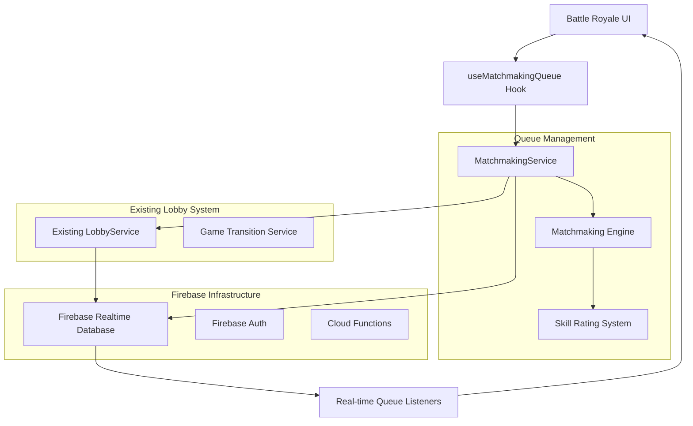
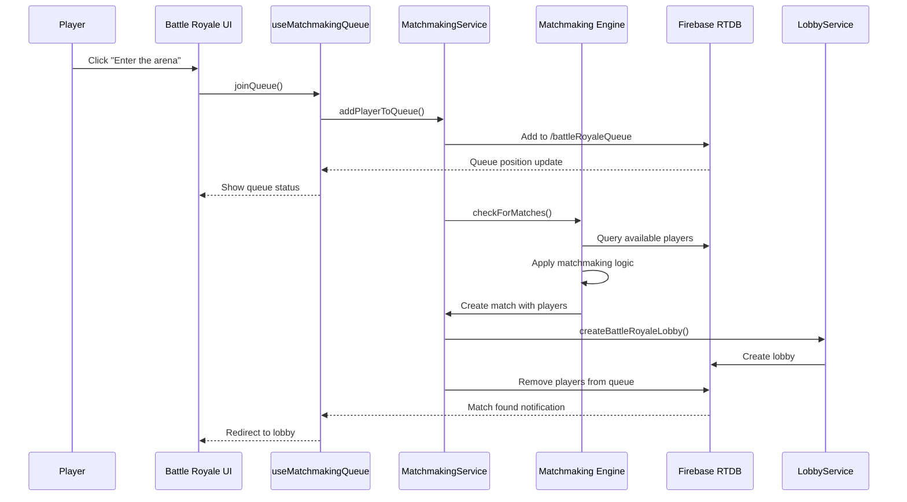

# Design Document

## Overview

The Meme Battle Royale system extends the existing lobby management architecture to provide automated matchmaking for competitive multiplayer meme battles. Unlike private lobbies where players manually invite friends, this system creates a queue-based matchmaking service that automatically pairs players based on availability, skill level, and connection quality.

The system leverages Firebase Realtime Database for real-time queue management and lobby creation, building upon the proven patterns from the existing private lobby system. The architecture prioritizes low latency, fair matchmaking, and seamless user experience while handling high-traffic scenarios during peak usage.

## Architecture

### High-Level System Architecture



### Matchmaking Flow Architecture



### Database Schema Design

The Battle Royale system extends the existing Firebase Realtime Database schema with new nodes for queue management and competitive statistics:

```json
{
  "battleRoyaleQueue": {
    "{playerUid}": {
      "displayName": "PlayerName",
      "avatarId": "doge-sunglasses",
      "profileURL": "https://...",
      "skillRating": 1200,
      "xpLevel": 15,
      "queuedAt": "2025-01-08T10:00:00.000Z",
      "estimatedWaitTime": 45,
      "preferences": {
        "maxWaitTime": 120,
        "skillRangeFlexibility": "medium"
      },
      "connectionInfo": {
        "region": "us-east",
        "latency": 25,
        "connectionQuality": "excellent"
      }
    }
  },
  "battleRoyaleStats": {
    "{playerUid}": {
      "gamesPlayed": 42,
      "wins": 15,
      "losses": 27,
      "winRate": 0.357,
      "skillRating": 1200,
      "highestRating": 1350,
      "currentStreak": 2,
      "longestWinStreak": 5,
      "averagePosition": 3.2,
      "totalXpEarned": 1250,
      "achievements": ["first_win", "five_game_streak"],
      "lastPlayed": "2025-01-08T10:00:00.000Z",
      "seasonStats": {
        "2025_season_1": {
          "gamesPlayed": 20,
          "wins": 8,
          "skillRatingChange": 150
        }
      }
    }
  },
  "matchmakingHistory": {
    "{matchId}": {
      "players": ["{playerUid1}", "{playerUid2}", "{playerUid3}"],
      "averageSkillRating": 1180,
      "skillRatingRange": 200,
      "matchQuality": 0.85,
      "createdAt": "2025-01-08T10:00:00.000Z",
      "lobbyCode": "ABC12",
      "matchDuration": 480,
      "winner": "{playerUid2}"
    }
  },
  "queueMetrics": {
    "currentQueueSize": 23,
    "averageWaitTime": 67,
    "peakHours": ["19:00", "20:00", "21:00"],
    "activeLobbies": 8,
    "matchesCreatedToday": 156,
    "lastUpdated": "2025-01-08T10:05:00.000Z"
  },
  "lobbies": {
    "{lobbyCode}": {
      // Existing lobby structure with Battle Royale enhancements
      "type": "battle_royale", // New field to distinguish from private lobbies
      "competitiveSettings": {
        "rounds": 8,
        "timeLimit": 45,
        "categories": [
          "general",
          "reaction",
          "wholesome",
          "gaming",
          "pop_culture"
        ],
        "autoStart": true,
        "autoStartCountdown": 30
      },
      "matchmakingInfo": {
        "matchId": "{matchId}",
        "averageSkillRating": 1180,
        "skillRatingRange": 200,
        "createdBy": "matchmaking_system"
      }
      // ... rest of existing lobby structure
    }
  }
}
```

## Components and Interfaces

### Core Service Layer

#### MatchmakingService

```typescript
interface QueueEntry {
  playerUid: string;
  displayName: string;
  avatarId: string;
  profileURL?: string;
  skillRating: number;
  xpLevel: number;
  queuedAt: string;
  estimatedWaitTime: number;
  preferences: QueuePreferences;
  connectionInfo: ConnectionInfo;
}

interface QueuePreferences {
  maxWaitTime: number; // seconds
  skillRangeFlexibility: 'strict' | 'medium' | 'flexible';
  regionPreference?: string;
}

interface ConnectionInfo {
  region: string;
  latency: number;
  connectionQuality: 'poor' | 'fair' | 'good' | 'excellent';
}

interface MatchmakingResult {
  matchId: string;
  players: QueueEntry[];
  averageSkillRating: number;
  skillRatingRange: number;
  matchQuality: number; // 0-1 score
  estimatedGameDuration: number;
}

interface BattleRoyaleStats {
  gamesPlayed: number;
  wins: number;
  losses: number;
  winRate: number;
  skillRating: number;
  highestRating: number;
  currentStreak: number;
  longestWinStreak: number;
  averagePosition: number;
  totalXpEarned: number;
  achievements: string[];
  lastPlayed: string;
  seasonStats: Record<string, SeasonStats>;
}

interface SeasonStats {
  gamesPlayed: number;
  wins: number;
  skillRatingChange: number;
  rank?: string;
  percentile?: number;
}

class MatchmakingService {
  private static instance: MatchmakingService;
  private readonly QUEUE_PATH = 'battleRoyaleQueue';
  private readonly STATS_PATH = 'battleRoyaleStats';
  private readonly METRICS_PATH = 'queueMetrics';
  private readonly MIN_PLAYERS_PER_MATCH = 3;
  private readonly MAX_PLAYERS_PER_MATCH = 8;
  private readonly OPTIMAL_PLAYERS_PER_MATCH = 6;

  // Queue Management
  async addPlayerToQueue(playerData: QueueEntry): Promise<ServiceResult>;
  async removePlayerFromQueue(playerUid: string): Promise<ServiceResult>;
  async getQueuePosition(playerUid: string): Promise<number>;
  async getEstimatedWaitTime(playerUid: string): Promise<number>;
  async updateQueuePreferences(
    playerUid: string,
    preferences: Partial<QueuePreferences>
  ): Promise<ServiceResult>;

  // Matchmaking Engine
  async findMatches(): Promise<MatchmakingResult[]>;
  async createBattleRoyaleLobby(
    match: MatchmakingResult
  ): Promise<ServiceResult<string>>;
  async fillExistingLobbies(): Promise<ServiceResult>;

  // Statistics Management
  async updatePlayerStats(
    playerUid: string,
    gameResult: GameResult
  ): Promise<ServiceResult>;
  async getPlayerStats(playerUid: string): Promise<BattleRoyaleStats>;
  async calculateSkillRating(
    playerUid: string,
    gameResult: GameResult
  ): Promise<number>;

  // Real-time Subscriptions
  subscribeToQueue(
    callback: (queueData: QueueEntry[]) => void
  ): UnsubscribeFunction;
  subscribeToQueuePosition(
    playerUid: string,
    callback: (position: number) => void
  ): UnsubscribeFunction;
  subscribeToMatchFound(
    playerUid: string,
    callback: (lobbyCode: string) => void
  ): UnsubscribeFunction;

  // Utility Methods
  private calculateMatchQuality(players: QueueEntry[]): number;
  private optimizePlayerGroups(players: QueueEntry[]): QueueEntry[][];
  private shouldExpandSkillRange(
    waitTime: number,
    preferences: QueuePreferences
  ): boolean;
}
```

#### Enhanced LobbyService Integration

```typescript
// Extensions to existing LobbyService for Battle Royale support
interface BattleRoyaleLobbyParams extends CreateLobbyParams {
  type: 'battle_royale';
  matchId: string;
  competitiveSettings: CompetitiveSettings;
  autoStart: boolean;
  autoStartCountdown: number;
}

interface CompetitiveSettings extends GameSettings {
  autoStart: boolean;
  autoStartCountdown: number;
  xpMultiplier: number;
  rankingEnabled: boolean;
}

// New methods added to LobbyService
class LobbyService {
  // ... existing methods ...

  async createBattleRoyaleLobby(
    params: BattleRoyaleLobbyParams
  ): Promise<ServiceResult<{ code: string; lobby: LobbyData }>>;
  async addPlayersToLobby(
    lobbyCode: string,
    players: QueueEntry[]
  ): Promise<ServiceResult>;
  async startAutoCountdown(lobbyCode: string): Promise<ServiceResult>;
  async cancelAutoCountdown(lobbyCode: string): Promise<ServiceResult>;
}
```

### Custom Hooks Layer

#### useMatchmakingQueue

```typescript
interface UseMatchmakingQueueReturn {
  // Queue State
  isInQueue: boolean;
  queuePosition: number;
  estimatedWaitTime: number;
  queueSize: number;
  isLoading: boolean;
  error: string | null;

  // Match State
  matchFound: boolean;
  lobbyCode: string | null;

  // Actions
  joinQueue: (preferences?: Partial<QueuePreferences>) => Promise<void>;
  leaveQueue: () => Promise<void>;
  updatePreferences: (preferences: Partial<QueuePreferences>) => Promise<void>;

  // Utilities
  canJoinQueue: boolean;
  timeInQueue: number;
  clearError: () => void;
}

function useMatchmakingQueue(): UseMatchmakingQueueReturn;
```

#### useBattleRoyaleStats

```typescript
interface UseBattleRoyaleStatsReturn {
  stats: BattleRoyaleStats | null;
  isLoading: boolean;
  error: string | null;

  // Actions
  refreshStats: () => Promise<void>;

  // Derived Data
  rank: string;
  percentile: number;
  nextRankProgress: number;
  recentPerformance: 'improving' | 'declining' | 'stable';
}

function useBattleRoyaleStats(playerUid?: string): UseBattleRoyaleStatsReturn;
```

### UI Components Architecture

```
components/
├── battle-royale/
│   ├── BattleRoyaleInterface.tsx      # Main Battle Royale container
│   ├── QueueStatus.tsx                # Queue position and wait time display
│   ├── MatchmakingProgress.tsx        # Visual progress indicator
│   ├── QueuePreferences.tsx           # Settings for matchmaking preferences
│   ├── BattleRoyaleStats.tsx          # Player statistics display
│   ├── SkillRatingDisplay.tsx         # Current skill rating and progress
│   ├── LeaderboardPreview.tsx         # Top players preview
│   └── MatchFoundNotification.tsx     # Match found transition component
├── lobby/
│   ├── BattleRoyaleLobby.tsx          # Enhanced lobby for competitive matches
│   ├── AutoStartCountdown.tsx         # Automatic game start countdown
│   ├── CompetitiveSettings.tsx        # Display competitive game settings
│   └── SkillRatingBadges.tsx          # Player skill indicators
└── shared/
    ├── LoadingSpinner.tsx             # Consistent loading states
    ├── ErrorBoundary.tsx              # Error handling wrapper
    └── ConnectionStatus.tsx           # Network status indicator
```

## Data Models

### Type Definitions

```typescript
// Queue and Matchmaking Types
type QueueStatus = 'waiting' | 'matching' | 'matched' | 'cancelled';
type MatchQuality = 'poor' | 'fair' | 'good' | 'excellent';
type SkillFlexibility = 'strict' | 'medium' | 'flexible';

// Game Result Types
interface GameResult {
  lobbyCode: string;
  matchId: string;
  playerUid: string;
  position: number; // 1st, 2nd, 3rd, etc.
  totalPlayers: number;
  score: number;
  roundsWon: number;
  totalRounds: number;
  gameMode: 'battle_royale';
  duration: number; // seconds
  xpEarned: number;
  skillRatingChange: number;
  achievements?: string[];
}

// Matchmaking Algorithm Types
interface MatchmakingCriteria {
  skillRatingWeight: number;
  connectionQualityWeight: number;
  waitTimeWeight: number;
  regionWeight: number;
  maxSkillRatingDifference: number;
  maxLatencyDifference: number;
}

interface MatchmakingConfig {
  criteria: MatchmakingCriteria;
  queueTimeouts: {
    expandSkillRange: number; // seconds
    offerAlternatives: number; // seconds
    maxWaitTime: number; // seconds
  };
  lobbySettings: {
    autoStartEnabled: boolean;
    countdownDuration: number;
    minPlayersToStart: number;
    maxPlayersPerLobby: number;
  };
}

// Statistics and Ranking Types
interface RankingTier {
  name: string;
  minRating: number;
  maxRating: number;
  color: string;
  icon: string;
  percentile: number;
}

interface Achievement {
  id: string;
  name: string;
  description: string;
  icon: string;
  rarity: 'common' | 'rare' | 'epic' | 'legendary';
  unlockedAt?: string;
}

// Queue Metrics Types
interface QueueMetrics {
  currentQueueSize: number;
  averageWaitTime: number;
  peakHours: string[];
  activeLobbies: number;
  matchesCreatedToday: number;
  averageMatchQuality: number;
  playerRetentionRate: number;
  lastUpdated: string;
}
```

### Skill Rating System

The skill rating system uses a modified Elo rating algorithm optimized for multiplayer games:

```typescript
interface SkillRatingCalculation {
  baseRating: number;
  kFactor: number; // Volatility factor based on games played
  positionMultiplier: number; // Bonus/penalty based on final position
  opponentRatingAverage: number;
  expectedScore: number;
  actualScore: number;
  ratingChange: number;
}

class SkillRatingSystem {
  private readonly BASE_RATING = 1200;
  private readonly MIN_RATING = 100;
  private readonly MAX_RATING = 3000;

  calculateRatingChange(
    currentRating: number,
    gameResult: GameResult,
    opponentRatings: number[]
  ): SkillRatingCalculation;

  getKFactor(gamesPlayed: number): number;
  getPositionMultiplier(position: number, totalPlayers: number): number;
  getRankingTier(rating: number): RankingTier;
  calculatePercentile(rating: number, allRatings: number[]): number;
}
```

## Error Handling

### Battle Royale Specific Error Types

```typescript
type BattleRoyaleErrorType =
  | 'QUEUE_FULL'
  | 'ALREADY_IN_QUEUE'
  | 'MATCHMAKING_TIMEOUT'
  | 'INSUFFICIENT_PLAYERS'
  | 'SKILL_RATING_UNAVAILABLE'
  | 'REGION_UNAVAILABLE'
  | 'MATCH_CREATION_FAILED'
  | 'STATS_UPDATE_FAILED';

interface BattleRoyaleError extends LobbyError {
  type: BattleRoyaleErrorType | LobbyErrorType;
  queuePosition?: number;
  estimatedWaitTime?: number;
  alternativeOptions?: string[];
}

const BATTLE_ROYALE_ERROR_STRATEGIES: Record<
  BattleRoyaleErrorType,
  ErrorRecoveryStrategy
> = {
  QUEUE_FULL: {
    retryable: true,
    maxRetries: 3,
    backoffStrategy: 'exponential',
    userMessage: 'Queue is currently full. Trying again...',
    fallbackAction: () => suggestPrivateLobby(),
  },
  MATCHMAKING_TIMEOUT: {
    retryable: false,
    maxRetries: 0,
    backoffStrategy: 'linear',
    userMessage:
      'Matchmaking is taking longer than expected. Try creating a private lobby or playing with AI.',
    fallbackAction: () => showAlternativeOptions(),
  },
  INSUFFICIENT_PLAYERS: {
    retryable: true,
    maxRetries: 5,
    backoffStrategy: 'linear',
    userMessage: 'Not enough players online right now. Expanding search...',
  },
};
```

### Graceful Degradation Strategies

1. **High Queue Volume**: Implement queue throttling and estimated wait times
2. **Low Player Count**: Suggest alternative game modes or AI opponents
3. **Network Issues**: Fall back to private lobby creation
4. **Skill Rating Unavailable**: Use random matchmaking as fallback
5. **Database Overload**: Implement client-side caching and retry mechanisms

## Testing Strategy

### Unit Testing

1. **MatchmakingService Methods**
   - Test queue management operations (add, remove, position tracking)
   - Validate matchmaking algorithm with various player combinations
   - Test skill rating calculations and edge cases
   - Verify error handling for network failures and invalid data

2. **Skill Rating System**
   - Test rating calculations for different game outcomes
   - Validate K-factor adjustments based on experience
   - Test ranking tier assignments and percentile calculations
   - Verify rating bounds and overflow protection

3. **Custom Hooks**
   - Test queue state management and real-time updates
   - Mock service layer for isolated testing
   - Test error states and recovery mechanisms
   - Validate derived state calculations

### Integration Testing

1. **End-to-End Matchmaking Flow**
   - Test complete flow from queue join to lobby creation
   - Verify real-time updates across multiple clients
   - Test automatic lobby creation and player assignment
   - Validate game start transitions and cleanup

2. **Concurrent Queue Operations**
   - Test multiple players joining/leaving queue simultaneously
   - Verify atomic operations prevent race conditions
   - Test queue position updates under high concurrency
   - Validate matchmaking fairness under load

3. **Cross-System Integration**
   - Test integration with existing lobby system
   - Verify game transition service compatibility
   - Test statistics tracking and skill rating updates
   - Validate Firebase security rules and permissions

### Performance Testing

1. **Scalability Testing**
   - Test queue performance with 100+ concurrent players
   - Measure matchmaking algorithm performance with large player pools
   - Test database query optimization under load
   - Validate real-time update latency at scale

2. **Load Testing**
   - Simulate peak traffic scenarios (500+ concurrent users)
   - Test Firebase connection limits and throttling
   - Measure queue processing throughput
   - Validate error handling under resource constraints

3. **Stress Testing**
   - Test system behavior at maximum capacity
   - Validate graceful degradation mechanisms
   - Test recovery after system overload
   - Measure impact on existing private lobby system

## Performance Optimizations

### Queue Management Optimizations

1. **Efficient Data Structures**

   ```typescript
   // Use indexed queries for fast queue operations
   const queueRef = query(
     ref(rtdb, 'battleRoyaleQueue'),
     orderByChild('queuedAt'),
     limitToFirst(50)
   );

   // Batch queue updates to reduce Firebase writes
   const batchUpdates: Record<string, unknown> = {};
   players.forEach((player) => {
     batchUpdates[`battleRoyaleQueue/${player.uid}`] = null;
     batchUpdates[`lobbies/${lobbyCode}/players/${player.uid}`] = player;
   });
   await update(ref(rtdb), batchUpdates);
   ```

2. **Matchmaking Algorithm Optimization**

   ```typescript
   // Pre-sort players by skill rating for O(n) matching
   const sortedPlayers = queuedPlayers.sort(
     (a, b) => a.skillRating - b.skillRating
   );

   // Use sliding window approach for skill-based grouping
   const matches = this.createMatchesWithSlidingWindow(
     sortedPlayers,
     targetGroupSize
   );
   ```

3. **Real-time Update Optimization**
   - Use Firebase's `limitToLast()` for queue position tracking
   - Implement client-side caching for queue metrics
   - Use delta updates for queue position changes
   - Batch notification updates to reduce listener overhead

### Database Indexing Strategy

```json
{
  "rules": {
    "battleRoyaleQueue": {
      ".indexOn": ["queuedAt", "skillRating", "region"]
    },
    "battleRoyaleStats": {
      ".indexOn": ["skillRating", "gamesPlayed", "lastPlayed"]
    },
    "matchmakingHistory": {
      ".indexOn": ["createdAt", "averageSkillRating"]
    }
  }
}
```

### Caching Strategy

1. **Client-Side Caching**
   - Cache player statistics for 5 minutes
   - Cache queue metrics for 30 seconds
   - Cache skill rating tiers and achievements indefinitely

2. **Firebase Offline Persistence**
   - Enable offline persistence for queue data
   - Implement conflict resolution for queue position updates
   - Cache matchmaking history for offline viewing

This design provides a comprehensive, scalable foundation for the Battle Royale matchmaking system that integrates seamlessly with the existing lobby infrastructure while providing competitive gameplay features and robust performance under high load.
