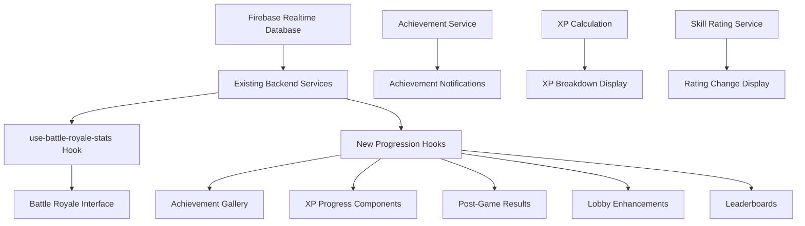

# Player Progression UI Design Document

## Overview

This design document outlines the implementation of comprehensive user interface components for the Player Progression Systems in Meme Battles. The design leverages the existing, fully functional backend systems for Skill Rating, XP, and Achievements while creating engaging, mobile-first UI components that provide clear feedback and motivation to players.

The design follows the established patterns in the codebase using Next.js 15.4.5, TypeScript, Tailwind CSS, shadcn/ui components, and Framer Motion animations, ensuring consistency with the existing Battle Royale interface and profile systems.

## Architecture

### Component Hierarchy

```
Player Progression UI System
├── Achievement System
│   ├── AchievementGallery (Profile Tab)
│   ├── AchievementCard (Individual Achievement Display)
│   ├── AchievementNotification (Toast/Modal System)
│   └── AchievementProgress (Progress Tracking)
├── XP System
│   ├── XPProgressBar (Level Progress Display)
│   ├── XPBreakdown (Post-Game XP Details)
│   ├── LevelUpCelebration (Level-Up Animation)
│   └── XPHistory (Profile XP Tracking)
├── Enhanced Results
│   ├── PostGameResults (Enhanced Results Screen)
│   ├── SkillRatingChange (Rating Change Display)
│   └── PerformanceTrends (Trend Indicators)
├── Lobby Enhancements
│   ├── PlayerSkillBadge (Lobby Player Info)
│   ├── MatchmakingInfo (Queue Information)
│   └── LobbyStats (Competitive Balance)
└── Leaderboards
    ├── GlobalLeaderboard (Rankings Display)
    ├── LeaderboardEntry (Individual Rank Display)
    └── PlayerSearch (Find Players)
```

### Data Flow Architecture



### State Management Strategy

- **Existing Hooks**: Leverage `use-battle-royale-stats` for core data
- **New Custom Hooks**: Create specialized hooks for UI-specific logic
- **SWR Integration**: Use existing SWR patterns for data fetching
- **Real-time Updates**: Maintain Firebase listeners for live updates
- **Local State**: React state for UI interactions and animations

## Components and Interfaces

### 1. Achievement System Components

#### AchievementGallery Component

**Location**: `components/achievement-gallery.tsx`

**Props Interface**:
```typescript
interface AchievementGalleryProps {
  achievements: Achievement[];
  unlockedAchievements: string[];
  className?: string;
}

interface Achievement {
  id: string;
  name: string;
  description: string;
  icon: string;
  rarity: 'common' | 'rare' | 'epic';
  category: 'win_streaks' | 'skill_milestones' | 'games_played';
  progress?: {
    current: number;
    target: number;
  };
  unlockedAt?: string;
}
```

**Key Features**:
- Grid layout with responsive breakpoints (1-2-3-4 columns)
- Filter tabs by category and rarity
- Search functionality for achievement names
- Smooth animations for filtering and state changes
- Achievement card hover effects with detailed tooltips

#### AchievementCard Component

**Location**: `components/achievement-card.tsx`

**Props Interface**:
```typescript
interface AchievementCardProps {
  achievement: Achievement;
  isUnlocked: boolean;
  progress?: ProgressData;
  size?: 'small' | 'medium' | 'large';
  showProgress?: boolean;
}
```

**Visual States**:
- **Unlocked**: Full color, achievement icon, unlock date
- **Locked**: Grayscale with silhouette, progress bar if applicable
- **Recently Unlocked**: Glow effect, celebration animation

#### AchievementNotification Component

**Location**: `components/achievement-notification.tsx`

**Props Interface**:
```typescript
interface AchievementNotificationProps {
  achievement: Achievement;
  onDismiss: () => void;
  autoHide?: boolean;
  duration?: number;
}
```

**Animation Sequence**:
1. Slide in from top with bounce effect
2. Rarity-based visual effects (confetti for epic, sparkles for rare)
3. Icon pulse animation
4. Auto-dismiss after 5 seconds or manual close
5. Queue system for multiple achievements

### 2. XP System Components

#### XPProgressBar Component

**Location**: `components/xp-progress-bar.tsx`

**Props Interface**:
```typescript
interface XPProgressBarProps {
  currentXP: number;
  currentLevel: number;
  xpForNextLevel: number;
  totalXPForNextLevel: number;
  showLabel?: boolean;
  size?: 'small' | 'medium' | 'large';
  animated?: boolean;
}
```

**Features**:
- Smooth progress bar animation
- Level indicator with current/next level display
- XP counter with animated number transitions
- Responsive sizing for different contexts

#### XPBreakdown Component

**Location**: `components/xp-breakdown.tsx`

**Props Interface**:
```typescript
interface XPBreakdownProps {
  baseXP: number;
  positionBonus: number;
  roundsBonus: number;
  totalXP: number;
  animated?: boolean;
}
```

**Animation Features**:
- Staggered counter animations for each XP source
- Visual breakdown with icons for each bonus type
- Total XP highlight with celebration effect

#### LevelUpCelebration Component

**Location**: `components/level-up-celebration.tsx`

**Props Interface**:
```typescript
interface LevelUpCelebrationProps {
  newLevel: number;
  onComplete: () => void;
  rewards?: LevelReward[];
}
```

**Animation Sequence**:
- Full-screen overlay with confetti effect
- Level number animation with scale and glow
- Reward showcase if applicable
- Celebration sound effect trigger

### 3. Enhanced Results Components

#### PostGameResults Component

**Location**: `components/post-game-results.tsx`

**Enhancement Strategy**:
- Extend existing results component with progression data
- Add skill rating change section
- Include XP breakdown display
- Show unlocked achievements
- Performance trend indicators

**New Props**:
```typescript
interface ProgressionData {
  skillRatingChange: {
    before: number;
    after: number;
    change: number;
    tierChange?: TierChange;
  };
  xpGained: XPBreakdown;
  achievementsUnlocked: Achievement[];
  performanceTrend: 'improving' | 'declining' | 'stable';
}
```

#### SkillRatingChange Component

**Location**: `components/skill-rating-change.tsx`

**Visual Elements**:
- Before/after rating display with animated transition
- Up/down arrow with color coding (green/red)
- Tier badge changes with celebration if tier up
- Progress towards next tier visualization

### 4. Lobby Enhancement Components

#### PlayerSkillBadge Component

**Location**: `components/player-skill-badge.tsx`

**Props Interface**:
```typescript
interface PlayerSkillBadgeProps {
  player: {
    uid: string;
    displayName: string;
    skillRating: number;
    level: number;
    tier: string;
  };
  showDetails?: boolean;
  size?: 'small' | 'medium';
}
```

**Display Elements**:
- Tier badge with appropriate colors
- Level indicator
- Skill rating number
- Optional win rate and recent performance

#### MatchmakingInfo Component

**Location**: `components/matchmaking-info.tsx`

**Features**:
- Estimated opponent skill level range
- Queue time display
- Match quality indicator
- Competitive balance visualization

### 5. Leaderboard Components

#### GlobalLeaderboard Component

**Location**: `components/global-leaderboard.tsx`

**Props Interface**:
```typescript
interface GlobalLeaderboardProps {
  timeframe: 'daily' | 'weekly' | 'monthly' | 'all-time';
  currentPlayerRank?: number;
  onPlayerSelect?: (playerId: string) => void;
}
```

**Features**:
- Top 100 players display with virtual scrolling
- Current player highlight and position
- Nearby players section (±10 ranks)
- Real-time rank updates
- Player search functionality

## Data Models

### Extended Type Definitions

```typescript
// Achievement System Types
interface AchievementDefinition {
  id: string;
  name: string;
  description: string;
  icon: LucideIcon;
  rarity: AchievementRarity;
  category: AchievementCategory;
  criteria: AchievementCriteria;
}

interface AchievementProgress {
  achievementId: string;
  current: number;
  target: number;
  percentage: number;
}

interface AchievementUnlock {
  achievementId: string;
  unlockedAt: string;
  gameId?: string;
}

// XP System Types
interface XPCalculation {
  baseXP: number;
  positionBonus: number;
  roundsBonus: number;
  totalXP: number;
  levelBefore: number;
  levelAfter: number;
  leveledUp: boolean;
}

interface LevelDefinition {
  level: number;
  xpRequired: number;
  totalXPRequired: number;
  rewards?: LevelReward[];
}

// Progression Display Types
interface ProgressionSummary {
  skillRating: SkillRatingData;
  xp: XPData;
  achievements: AchievementData;
  performance: PerformanceData;
}

interface SkillRatingData {
  current: number;
  change: number;
  tier: RankingTier;
  nextTier?: RankingTier;
  progressToNext: number;
}
```

### Database Schema Extensions

```typescript
// Firebase Realtime Database Structure
interface PlayerProgressionData {
  // Existing fields maintained
  skillRating: number;
  totalXpEarned: number;
  achievements: string[];
  
  // New fields for UI enhancement
  xpHistory: XPHistoryEntry[];
  achievementProgress: Record<string, number>;
  lastLevelUp?: string;
  notificationQueue: AchievementNotification[];
}

interface XPHistoryEntry {
  gameId: string;
  timestamp: string;
  xpGained: number;
  source: 'battle_royale' | 'daily_bonus' | 'achievement';
  details: XPBreakdown;
}
```

## Error Handling

### Error Boundaries and Fallbacks

1. **Achievement Gallery Errors**:
   - Fallback to "Coming Soon" state if data fails to load
   - Individual achievement card error states
   - Retry mechanisms for failed achievement data

2. **XP Calculation Errors**:
   - Fallback to basic XP display if breakdown fails
   - Graceful degradation for animation failures
   - Error logging for XP calculation mismatches

3. **Leaderboard Errors**:
   - Offline state handling with cached data
   - Network error recovery with retry buttons
   - Partial data display when some ranks fail to load

4. **Real-time Update Errors**:
   - Firebase listener error recovery
   - Stale data indicators
   - Manual refresh options

### Error Recovery Strategies

```typescript
// Achievement Gallery Error Boundary
const AchievementGalleryErrorBoundary: React.FC = ({ children }) => {
  return (
    <ErrorBoundary
      fallback={<AchievementGalleryFallback />}
      onError={(error) => {
        Sentry.captureException(error);
        console.error('Achievement Gallery Error:', error);
      }}
    >
      {children}
    </ErrorBoundary>
  );
};

// XP Progress Error Handling
const useXPProgressWithFallback = (playerData: PlayerData) => {
  const [error, setError] = useState<Error | null>(null);
  
  try {
    return calculateXPProgress(playerData);
  } catch (err) {
    setError(err as Error);
    Sentry.captureException(err);
    return getBasicXPDisplay(playerData);
  }
};
```

## Testing Strategy

### Component Testing Approach

1. **Unit Tests**:
   - Individual component rendering
   - Props validation and type safety
   - Animation state management
   - Error boundary functionality

2. **Integration Tests**:
   - Achievement notification flow
   - XP calculation and display
   - Real-time data updates
   - Cross-component interactions

3. **Visual Regression Tests**:
   - Achievement gallery layouts
   - Progress bar animations
   - Notification positioning
   - Mobile responsive behavior

4. **Performance Tests**:
   - Large achievement list rendering
   - Animation performance on mobile
   - Memory usage with real-time updates
   - Bundle size impact

### Test Coverage Requirements

- **Achievement Components**: 85% coverage minimum
- **XP Components**: 80% coverage minimum
- **Integration Flows**: 75% coverage minimum
- **Error Handling**: 90% coverage minimum

### Testing Tools and Patterns

```typescript
// Achievement Gallery Test Example
describe('AchievementGallery', () => {
  it('should render achievements with correct filtering', async () => {
    const mockAchievements = createMockAchievements();
    render(<AchievementGallery achievements={mockAchievements} />);
    
    // Test filtering functionality
    fireEvent.click(screen.getByText('Rare'));
    expect(screen.getAllByTestId('achievement-card')).toHaveLength(3);
  });
  
  it('should handle achievement unlock animations', async () => {
    const { rerender } = render(<AchievementGallery achievements={[]} />);
    
    // Simulate achievement unlock
    rerender(<AchievementGallery achievements={[newAchievement]} />);
    
    expect(screen.getByTestId('achievement-unlock-animation')).toBeInTheDocument();
  });
});
```

## Performance Considerations

### Optimization Strategies

1. **Component Optimization**:
   - React.memo for expensive achievement cards
   - useMemo for achievement filtering and sorting
   - useCallback for event handlers
   - Lazy loading for achievement icons

2. **Animation Performance**:
   - CSS transforms over layout changes
   - requestAnimationFrame for smooth animations
   - Reduced motion support
   - GPU acceleration for complex animations

3. **Data Management**:
   - Virtualized scrolling for large leaderboards
   - Pagination for achievement history
   - Debounced search inputs
   - Optimistic updates for better UX

4. **Bundle Optimization**:
   - Code splitting for leaderboard components
   - Dynamic imports for celebration animations
   - Tree shaking for unused achievement icons
   - Compressed image assets

### Mobile Performance

1. **Touch Interactions**:
   - 44px minimum touch targets
   - Fast tap responses (<100ms)
   - Smooth scroll performance
   - Gesture conflict prevention

2. **Memory Management**:
   - Component cleanup on unmount
   - Image lazy loading and cleanup
   - Animation cleanup
   - Event listener removal

3. **Network Optimization**:
   - Progressive data loading
   - Offline state handling
   - Compressed data transfers
   - Smart caching strategies

## Accessibility Implementation

### WCAG 2.1 AA Compliance

1. **Keyboard Navigation**:
   - Tab order for achievement gallery
   - Arrow key navigation for leaderboards
   - Enter/Space activation for interactive elements
   - Escape key for modal dismissal

2. **Screen Reader Support**:
   - Semantic HTML structure
   - ARIA labels for progress bars
   - Live regions for dynamic updates
   - Descriptive alt text for achievement icons

3. **Visual Accessibility**:
   - High contrast mode support
   - Color-blind friendly color schemes
   - Scalable text and UI elements
   - Focus indicators for all interactive elements

4. **Motion Accessibility**:
   - Respect prefers-reduced-motion
   - Alternative static displays
   - Optional animation controls
   - No auto-playing animations over 5 seconds

### Accessibility Testing

```typescript
// Accessibility Test Example
describe('Achievement Gallery Accessibility', () => {
  it('should be navigable with keyboard', () => {
    render(<AchievementGallery achievements={mockAchievements} />);
    
    const firstCard = screen.getAllByRole('button')[0];
    firstCard.focus();
    
    fireEvent.keyDown(firstCard, { key: 'ArrowRight' });
    expect(screen.getAllByRole('button')[1]).toHaveFocus();
  });
  
  it('should announce achievement unlocks to screen readers', () => {
    const { rerender } = render(<AchievementNotification achievement={null} />);
    
    rerender(<AchievementNotification achievement={mockAchievement} />);
    
    expect(screen.getByRole('alert')).toHaveTextContent('Achievement unlocked: Hat Trick');
  });
});
```

This design provides a comprehensive foundation for implementing the missing UI components while maintaining consistency with the existing codebase and ensuring excellent user experience across all devices and accessibility needs.