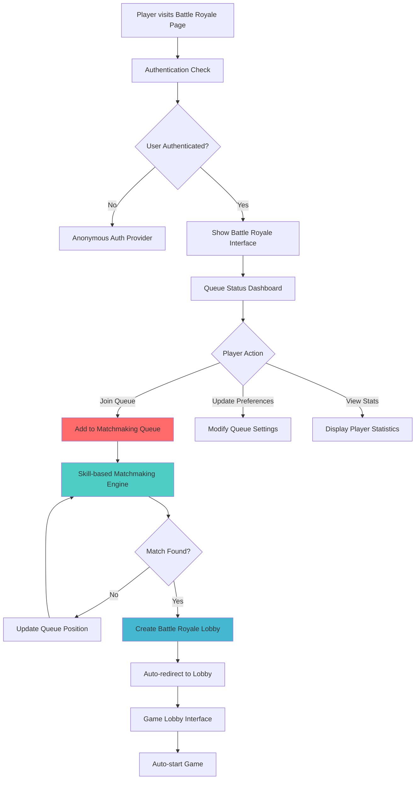
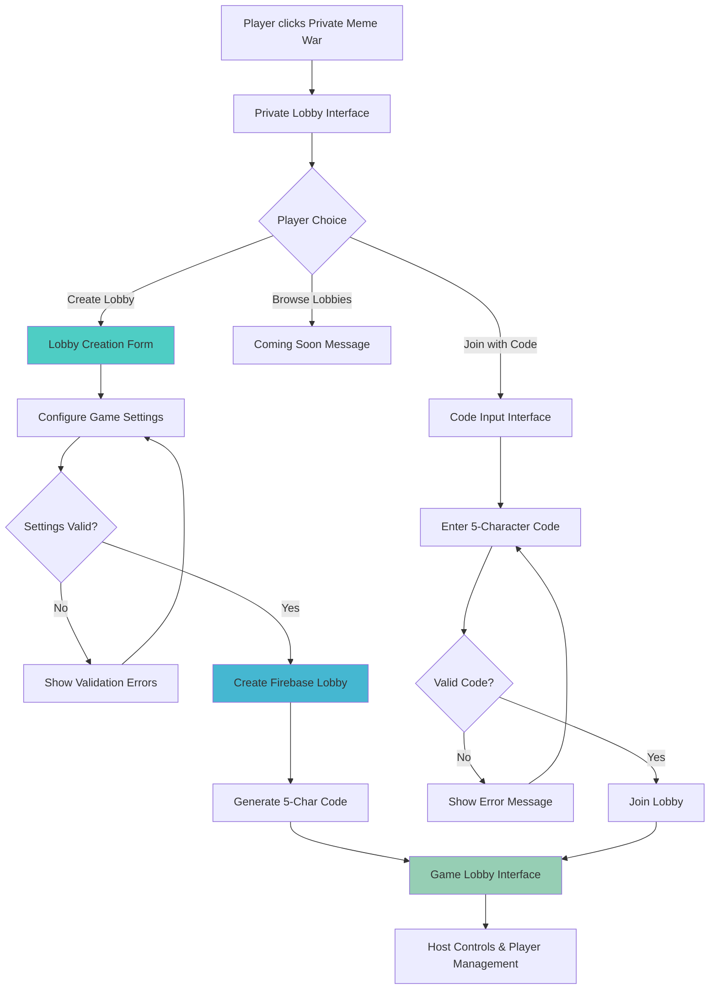
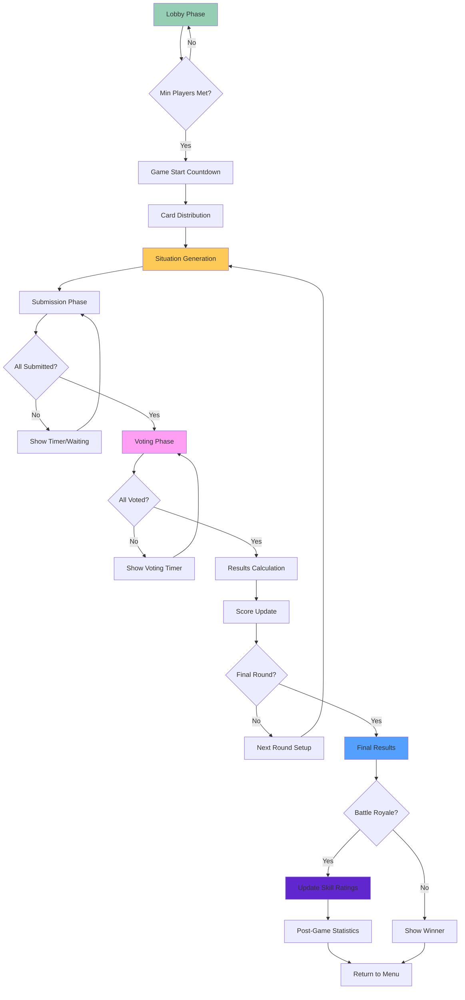
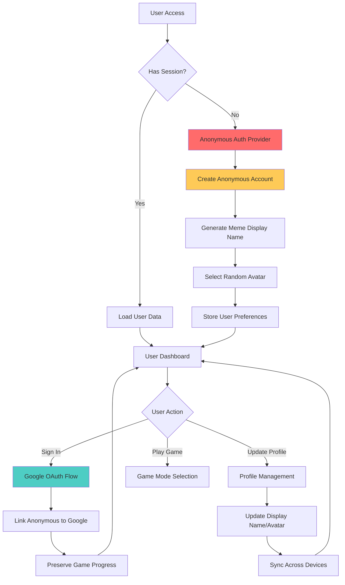

# Meme Battles - Complete Game Flow Documentation

## Project Overview

**Meme Battles** is a sophisticated real-time multiplayer web game featuring Battle Royale matchmaking, AI-powered opponents, and dynamic meme-based gameplay. Players compete by selecting the best meme cards for generated situations, with voting-based scoring and competitive ranking systems.

### Core Technology Stack
- **Framework**: Next.js 15.4.5 with App Router & TypeScript
- **Database**: Firebase Realtime Database + Firestore
- **Authentication**: Firebase Auth (Google + Guest modes)
- **AI**: Vercel AI SDK with Google AI for situation generation
- **Real-time**: Firebase Realtime Database listeners
- **State Management**: SWR + React hooks
- **UI**: Tailwind CSS + shadcn/ui components
- **Testing**: Jest + Testing Library (70% coverage target)

## Game Modes

### 1. Battle Royale Mode
**Competitive matchmaking with skill-based rating system**

#### Flow Overview


#### Detailed Battle Royale Flow

##### 1. Queue Entry Phase
- **Path**: `/battle-royale`
- **Component**: `BattleRoyaleInterface`
- **Service**: `MatchmakingService`

**Player Journey:**
1. Player clicks "Meme Battle Royale" from main menu
2. System validates authentication status
3. Interface displays current queue statistics
4. Player configures preferences:
   - Skill range flexibility (strict/medium/flexible)
   - Maximum wait time (30s - 10min)
   - Connection quality requirements
5. Player joins queue with skill rating and preferences

**Queue Management:**
- FIFO queue with skill-based grouping
- Real-time position updates
- Dynamic wait time estimation
- Connection quality monitoring

##### 2. Matchmaking Engine
- **Algorithm**: Skill-based sliding window with expansion over time
- **Group Size**: 3-8 players (optimal: 6 players)
- **Matching Criteria**:
  - Skill rating compatibility (±100-400 points based on wait time)
  - Connection quality (regional preference)
  - Queue time fairness (FIFO within skill brackets)

**Match Quality Calculation:**
- 40% Skill balance (variance-based scoring)
- 30% Connection quality compatibility
- 20% Wait time fairness
- 10% Player count bonus

##### 3. Lobby Creation & Game Flow
Once matched, follows standard game flow (see Game Loop section)

### 2. Private Battle Mode
**Friend-based lobby system with custom settings**

#### Flow Overview


#### Detailed Private Battle Flow

##### 1. Lobby Creation
**Game Settings Configuration:**
- **Rounds**: 1-15 (default: 5)
- **Time Limit**: 15-120 seconds per round (default: 30s)
- **Categories**: Multiple meme categories selection
- **Max Players**: 3-8 players (default: 6)
- **Auto-start Options**: Manual or automatic with countdown

**Advanced Settings:**
- AI bot integration (Easy/Medium/Hard personalities)
- Custom meme deck selection
- XP multipliers for competitive play
- Spectator mode options

##### 2. Lobby Management
**Host Capabilities:**
- Start/stop game
- Kick players
- Modify settings (before game starts)
- Add AI bots
- Enable/disable auto-countdown

**Player Experience:**
- Real-time chat system
- Connection status monitoring
- Ready/unready states
- Lobby code sharing

## Core Game Loop

### Universal Game Flow (Both Modes)


### Phase-by-Phase Breakdown

#### Phase 1: Lobby Management
**Components**: `GameLobby`, `LobbyInterface`, `PlayerList`
**Services**: `LobbyService`

**Features:**
- Real-time player synchronization
- Connection status monitoring
- Chat system with message persistence
- Host controls and player permissions
- Auto-countdown when minimum players reached

#### Phase 2: Card Distribution
**Service**: `LobbyService.distributeCards()`
**Algorithm**: 
- Selects 7 unique cards from 800+ meme collection
- Ensures no duplicate cards within a lobby
- Weighted distribution based on category preferences
- Image lazy loading for performance

#### Phase 3: AI Situation Generation
**Service**: Vercel AI SDK + Google AI
**Component**: `GamePlay`

**Process:**
1. Generate contextual meme situation using AI
2. Ensure situation is appropriate and engaging
3. Display situation to all players simultaneously
4. Start submission timer

**AI Prompt Engineering:**
- Context-aware situation generation
- Humor and engagement optimization
- Category-based prompt variations
- Content moderation integration

#### Phase 4: Submission Phase
**Timer**: 15-120 seconds (configurable)
**Component**: `MemeCardHand`, `MemeCard`

**Player Actions:**
- Review hand of 7 meme cards
- Select one card as submission
- Submit before timer expires
- View other players' submission status (not cards)

**Auto-submission**: Random card if timer expires

#### Phase 5: Voting Phase
**Component**: `VotingPhase`
**Rules**:
- One vote per player
- Cannot vote for own submission
- Anonymous voting (cards displayed without names)
- 30-60 second voting timer

**AI Bot Voting**: Personality-based decision making
- Easy bots: random-weighted voting
- Medium bots: basic context analysis  
- Hard bots: sophisticated humor evaluation

#### Phase 6: Results & Scoring
**Component**: `ResultsPhase`
**Scoring System**:
- Winner (most votes): 3 points + bonus
- Second place: 2 points
- Third place: 1 point
- Participation: 0 points
- Bonus points for unanimous wins

**Battle Royale Scoring**:
- XP rewards based on final position
- Skill rating adjustments (Elo-based)
- Achievement progress tracking

## Authentication & User Management

### Authentication Flow


### User Data Structure
- **Anonymous Users**: Temporary IDs with meme-themed names
- **Google Users**: Persistent accounts with profile data
- **Profile Data**: Display name, avatar, preferences, statistics
- **Session Management**: HTTP-only cookies for security

## Data Architecture

### Firebase Realtime Database Schema
```json
{
  "lobbies": {
    "lobbyCode": {
      "code": "ABC123",
      "hostUid": "user123",
      "settings": {
        "rounds": 10,
        "timeLimit": 60,
        "categories": ["general", "reaction"],
        "maxPlayers": 8
      },
      "players": {
        "user123": {
          "displayName": "EpicChad",
          "avatarId": "doge",
          "score": 0,
          "ready": true,
          "connectionStatus": "connected"
        }
      },
      "gameState": {
        "phase": "waiting",
        "currentRound": 1,
        "submissions": {},
        "votes": {},
        "results": {}
      },
      "chat": {
        "msgId": {
          "message": "Hello!",
          "timestamp": 1234567890,
          "playerUid": "user123"
        }
      }
    }
  },
  "battleRoyaleQueue": {
    "playerUid": {
      "skillRating": 1200,
      "queuedAt": "2024-01-01T00:00:00.000Z",
      "preferences": {
        "maxWaitTime": 300,
        "skillRangeFlexibility": "medium"
      },
      "connectionInfo": {
        "latency": 45,
        "region": "us-east",
        "connectionQuality": "good"
      }
    }
  },
  "battleRoyaleStats": {
    "playerUid": {
      "gamesPlayed": 50,
      "wins": 12,
      "skillRating": 1350,
      "winRate": 0.24,
      "currentStreak": 3,
      "averagePosition": 3.2,
      "totalXpEarned": 15600
    }
  }
}
```

### Key Data Patterns
- **Atomic Operations**: All multi-field updates use transactions
- **Real-time Listeners**: Efficient subscription management
- **Connection Management**: Heartbeat monitoring and cleanup
- **Data Cleanup**: Automatic removal of stale lobbies and queue entries

## Performance & Scalability

### Optimization Strategies
1. **Image Loading**: Lazy loading for 800+ meme cards
2. **Connection Pooling**: Singleton services with connection reuse
3. **Real-time Efficiency**: Targeted listeners and subscription cleanup
4. **Caching**: SWR with 5-minute TTL for user data
5. **Mobile Optimization**: 320px minimum width support

### Error Handling & Monitoring
- **Sentry Integration**: Comprehensive error tracking
- **Error Boundaries**: Graceful failure handling
- **Retry Logic**: Exponential backoff for failed operations
- **Connection Recovery**: Automatic reconnection with status monitoring

### Testing Strategy
- **Unit Tests**: Individual functions and hooks
- **Integration Tests**: Service layer with Firebase mocking
- **Coverage Target**: 70% across all metrics
- **E2E Testing**: Critical user flows (planned)

## Competitive Features

### Skill Rating System
- **Algorithm**: Elo-based with position weighting
- **Factors**: Final position, opponent skill levels, game completion
- **Rating Ranges**: 
  - Bronze: 100-799
  - Silver: 800-1099  
  - Gold: 1100-1399
  - Platinum: 1400-1699
  - Diamond: 1700-2199
  - Master: 2200+

### Achievement System
- **Categories**: Games played, win streaks, skill milestones
- **Rewards**: XP bonuses, cosmetic unlocks, titles
- **Progress Tracking**: Real-time achievement monitoring

### Leaderboards & Statistics
- **Global Rankings**: Skill rating leaderboards
- **Personal Stats**: Win rate, average position, games played
- **Seasonal Resets**: Periodic rating adjustments
- **Historical Data**: Match history and performance trends

## Development & Deployment

### Code Organization
```
/app                    # Next.js App Router
  /(auth)              # Authentication routes
  /(front)             # Main application routes
/components             # React components by domain
  /forms               # Form-specific components
  /game-settings       # Game configuration
  /shared              # Cross-feature components
  /ui                  # shadcn/ui components only
/hooks                  # Custom React hooks
/lib                    # Utilities and services
  /actions             # Next.js Server Actions
  /services            # Business logic services
/providers              # React context providers
/types                  # TypeScript definitions
```

### Development Commands
- `pnpm dev` - Development server with Turbopack
- `pnpm build` - Production build
- `bun lint` - Biome linting (0 errors target)
- `pnpm test` - Jest testing with 70% coverage
- `pnpm test:coverage` - Coverage report generation

### Environment Requirements
- **Firebase**: Project configuration with RTDB and Auth
- **Google AI**: API key for Vercel AI SDK
- **Sentry**: Error tracking and performance monitoring
- **Vercel/Netlify**: Deployment platform with serverless functions

## Future Enhancements

### Planned Features
1. **Tournament Mode**: Bracket-style competitive events
2. **Custom Meme Upload**: User-generated content with moderation
3. **Spectator Mode**: Watch live games with chat
4. **Team Battles**: Collaborative meme selection
5. **Voice Chat**: Optional voice communication
6. **Mobile App**: React Native companion app
7. **Streaming Integration**: Twitch/YouTube streaming support

### Technical Improvements
1. **Advanced Analytics**: Player behavior tracking
2. **Machine Learning**: Improved AI situation generation
3. **CDN Optimization**: Global meme image distribution
4. **Database Sharding**: Horizontal scaling for large user base
5. **Real-time Spectating**: Live game viewing with minimal delay

---

## Quick Reference

### Key Components
- `HeroSection` - Main menu with game mode selection
- `BattleRoyaleInterface` - Competitive matchmaking interface  
- `PrivateLobbySection` - Friend lobby creation/joining
- `GameLobby` - Pre-game player management
- `GamePlay` - Main game interface with phases
- `VotingPhase` - Card voting interface
- `ResultsPhase` - Round results and scoring

### Key Services
- `MatchmakingService` - Battle Royale queue management
- `LobbyService` - Lobby CRUD and real-time sync
- `AIBotService` - AI opponent management
- `SkillRatingService` - Competitive rating calculations

### Key Hooks
- `useCurrentUser` - User authentication and profile
- `useMatchmakingQueue` - Battle Royale queue state
- `useLobbyManagement` - Lobby creation and joining
- `useBattleRoyaleStats` - Player statistics and ranking

This documentation provides a comprehensive overview of the Meme Battles game flow, covering both Battle Royale and Private Battle modes with detailed technical implementation and user experience considerations.